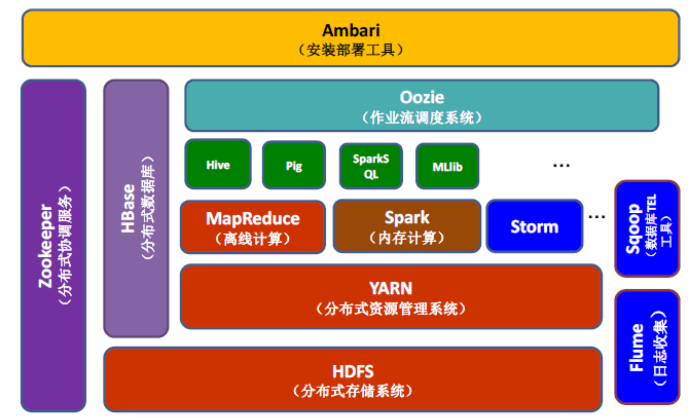
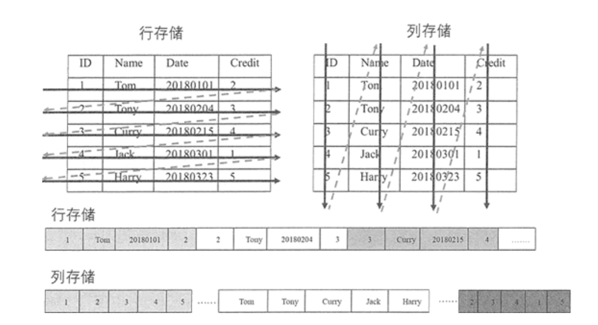
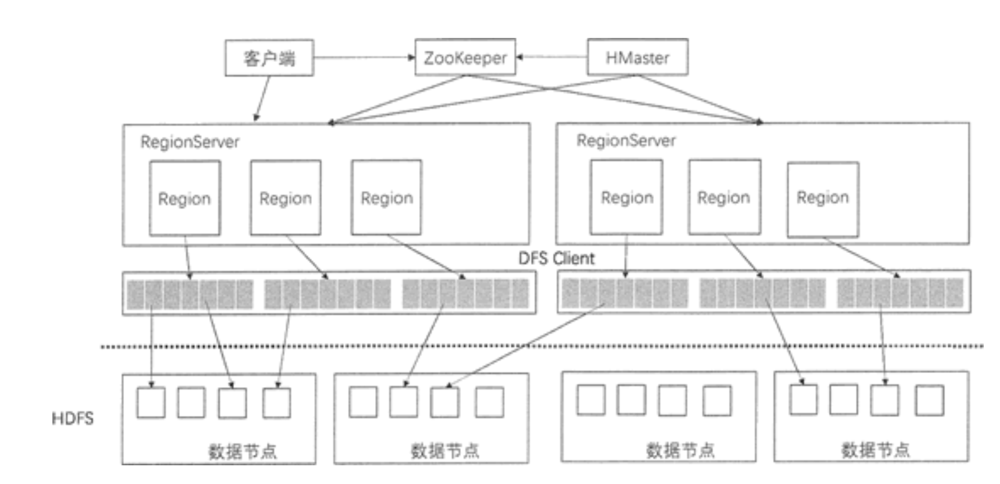
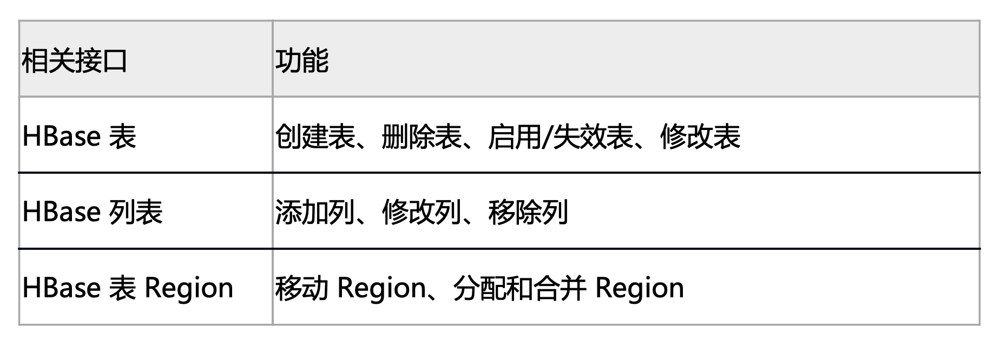
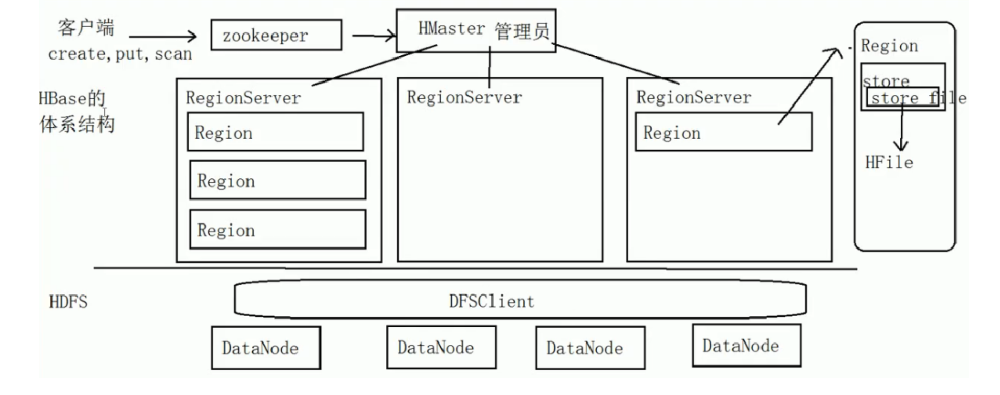
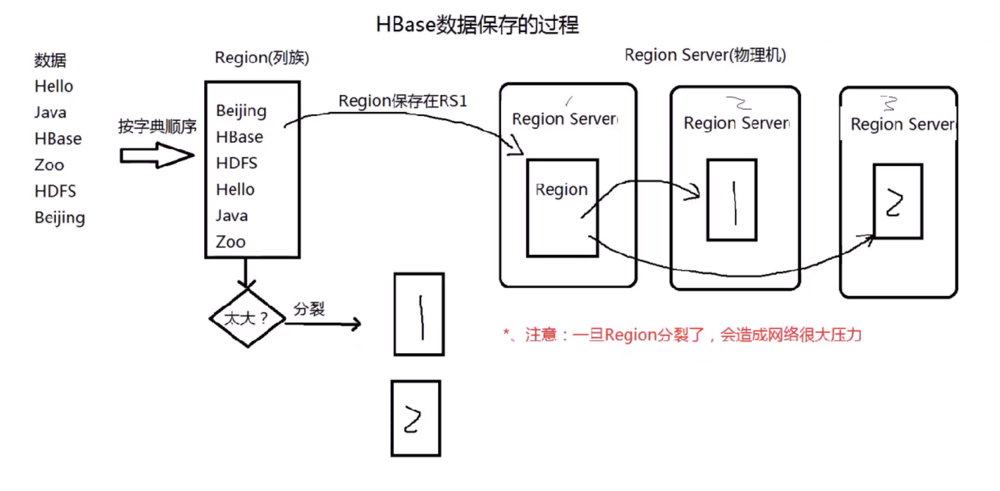
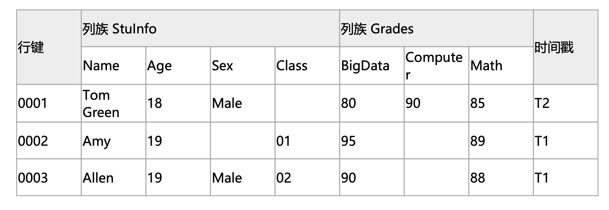
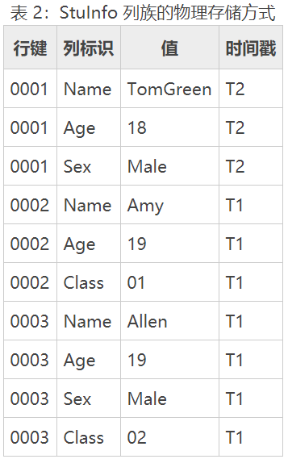

### HBase概述

HBase 是一个**开源的、分布式的、版本化的非关系型数据库**，HBase 作为 Apache 基金会的 Hadoop 项目的一部分，使用 Java 语言实现， **将 HDFS 作为底层文件存储系统**，在此基础上运行 **MapReduce 进行分布式的 批量处理数据**，为 Hadoop 提供海量数据管理的服务。

HBase 是一个可以进行随机访问的存取和检索数据的存储平台，存储**结构化和半结构化**的数据，因此一般的网站可以将网页内容和日志信息都存在 HBase 里。如果数据量不是非常庞大，HBase 甚至可以存储**非结构化的数据**。它不要求数据有预定义的模式，允许动态和灵活的数据模型，也不限制存储数据的类型。

HBase的目标是**存储并处理大型的数据**，更具体来说是仅需使用普通的硬件配置，就能够处理 由成千上万的行和列所组成的大型数据。

HBase的**原型是Google的BigTable论文**，HBase是 Google Bigtable的开源实现，但是也有很多不同之处。HBase**利用Hadoop HDFS作为其文件存储系统**;Google运行MapReduce来处理Bigtable中的海量数据，HBase同 样利用Hadoop MapReduce来处理HBase中的海量数据;Google Bigtable利用Chubby作为**协同服务**，HBase利用**Zookeeper**作为对应。

**bigTable特性**

BigTable 是完全违背范式要求的 ---> 存在数据的冗余 ----> 好处：提高（查询）性能

BigTable 把所有的数据存在一张表中 ----> HBase NoSQL 数据库 ---> 面向列 ----> 列式数据库

### Hadoop与HBase的关系

HBase 与 HDFS 有非常紧密的关系，它使用 HDFS 作为底层存储系统。 虽然 HBase 可以单独运行在本地文件系统上，但这不是 HBase 设计的初衷。

**HBase 是在 Hadoop 这种分布式框架中提供持久化的数据存储与管理的工具**。在使用 HBase 的分布式集群模式时，前提是必须有 Hadoop 系统。

Hadoop 系统为 HBase 提供给了分布式文件存储系统，同时也使得 **MapReduce 组件能够直接访问 HBase 进行分布式计算**。

HBase **最重要的访问方式是 Java API**(Application Programming Interface，应用程序 编程接口)，MapReduce 的批量操作方式并不常用。

**HBase 在 Hadoop 生态系统中的位置**

### HBase特性

HBase 是典型的 NoSQL 数据库，通常被描述成**稀疏的、分布式的、持久化的，由行键、 列键和时间戳进行索引的多维有序映射数据库**，**主要用来存储非结构化和半结构化的数据**。 因为 HBase 基于 Hadoop 的 HDFS 完成分布式存储，以及 MapReduce 完成分布式并行计算，所以它的一些特点与 Hadoop 相同，依靠横向扩展，通过不断增加性价比高的商业服务器来增加计算和存储能力。

HBase 虽然基于 Bigtable 的开源实现，但它们之间还是有很多差别的，Bigtable 经常被描述成**键值数据库**，而 HBase 则是**面向列存储的分布式数据库**。

**HBase 特性**：

1. **容量巨大**

HBase 的单表可以有百亿行、百万列，可以在横向和纵向两个维度插入数据，具有很大的弹性。

当关系型数据库的单个表的记录在亿级时，查询和写入的性能都会呈现指数级下降，这种庞大的数据量对传统数据库来说是一种灾难，而 HBase 在限定某个列的情况下对于单表存储百亿甚至更多的数据都没有性能问题。

HBase 采用 **LSM 树作为内部数据存储结构**，这种结构会周期性地将较小文件合并成大文件，以减少对磁盘的访问。

2. **列存储**

与很多面向行存储的关系型数据库不同，HBase 是**面向列的存储**和权限控制的，它里面的每个列是单独存储的，且支持基于列的独立检索。在这种情况下，进行数据的插入和更新，行存储会相对容易。而进行行存储时，查询操作需要读取所有的数据，列存储则只需要读取相关列，可以大幅降低系统 I/O 吞吐量。

3. **稀疏性**

通常在传统的关系性数据库中，每一列的数据类型是事先定义好的，会占用固定的内存空 间，在此情况下，属性值为空(NULL)的列也需要占用存储空间。

而在 HBase 中的数据都是以字符串形式存储的，为空的列并不占用存储空间，因此 HBase 的列存储解决了数据稀疏性的问题，在很大程度上节省了存储开销。所以 HBase 通常可以设计成稀疏矩阵，同时这种方式比较接近实际的应用场景。

4. **扩展性强**

HBase 工作在 HDFS 之上，理所当然地支持分布式表，也继承了 HDFS 的可扩展性。

HBase 表**根据 Region 大小进行分区**，分别存在集群中不同的节点上，当添加新的节点时，集群就重新调整，在新的节点启动 HBase 服务器，动态地实现扩展。这里需要指出， HBase 的扩展是**热扩展**，即在不停止现有服务的前提下，可以随时添加或者减少节点。

5. 高可靠性

HBase 运行在 HDFS 上，HDFS 的多副本存储可以让它在岀现故障时自动恢复，同时 HBase 内部也提供 **WAL 和 Replication 机制。**

**WAL(Write-Ahead-Log)预写日志**是在 HBase 服务器处理数据插入和删除的过程中用来记录操作内容的日志，保证了数据写入时不会因集群异常而导致写入数据的丢失;而 **Replication 机制**是基于日志操作来做数据同步的。

当集群中单个节点出现故障时，协调服务组件 ZooKeeper 通知集群的主节点，将故障节点的 HLog 中的日志信息分发到各从节点进行数据恢复。

### HBase架构

HBase的组件和功能

 HBase 的系统架构，包括**客户端、ZooKeeper 服务器、HMaster 主服务器和 RegionServer**。

**Region** 是 HBase中数据的物理切片，每个 Region 中记录了全局数据的一小部分，并且不同的 Region 之间的数据是互不重复的。

#### **客户端**
客户端包含访问 HBase 的接口，是整个 HBase 系统的入口，使用者直接通过客户端操作 HBase。客户端使用 HBase 的 RPC 机制与 **HMaster 和 RegionServer** 进行通信。

在一般情况下，**客户端**与 **HMaster** 进行管理类操作的通信，在获取 **RegionServer** 的信息后，直接与 RegionServer 进行数据读写类操作。而且客户端获取 Region 的位置信息后会缓存下来，用来加速后续数据的访问过程。

客户端可以用 Java 语言来实现，也可以使用 Thtift、Rest 等客户端模式，甚至 MapReduce 也可以算作一种客户端。

#### **Zookeeper**

ZooKeeper 是一个**高性能、集中化、分布式应用程序协调服务**，主要是用来解决分布式应用中用户经常遇到的一些数据管理问题，例如，数据发布/订阅、命名服务、分布式协调通 知、集群管理、Master 选举、分布式锁和分布式队列等功能。其中，**Master 选举是 ZooKeeper 最典型的应用场景**。

在 Hadoop 中，**ZooKeeper** 主要用于实现**高可靠性(High Availability, HA)**，包括 **HDFS 的 NameNode 和 YARN 的 ResourceManager 的 HA**。 以 HDFS 为例， NameNode 作为 HDFS 的主节点，负责管理文件系统的命名空间以及客户端对文件的访问，同时需要监控整个 HDFS 中每个 DataNode 的状态，实现负载均衡和容错。为了实现 HA，必须有多个 NameNode 并存，并且只有一个 NameNode 处于活跃状态，其他的则处于备用状态。当活跃的 NameNode 无法正常工作时， 处于备用状态的 NameNode 会通过竞争选举产生新的活跃节点来保证 HDFS 集群的高可靠性。

在 HBase 的系统架构中，**ZooKeeper 是串联 HBase 集群和 Client 的 关键**。

ZooKeeper 在 HBase 中的负责协调的任务如下。

**Master 选举**
同 HDFS 的 HA 机制一样，HBase 集群中有多个 HMaster 并存，通过竞争选举机制保证 同一时刻只有一个 HMaster 处于活跃状态，一旦这个 HMaster 无法使用，则从备用节点中选出一个顶上，保证集群的高可靠性。

**系统容错**
在 HBase 启动时，每个 RegionServer 在加入集群时都需要到 ZooKeeper 中进行注册， 创建一个状态节点，**ZooKeeper 会实时监控每个 RegionServer 的状态**，同时 HMaster会监听这些注册的 RegionServer。当某个 RegionServer 挂断的时候，ZooKeeper 会因为一段时间内接收不到它的**心跳信息**而删除该 RegionServer 对应的状态节点，并且给 HMaster 发送节点删除的通知。这时，HMaster 获知集群中某节点断开，会立即调度其他节点开启容错机制。

**Region 元数据管理**
在 HBase 集群中，Region 元数据被存储在 Meta 表中。每次客户端发起新的请求时，需要查询 Meta 表来获取 Region 的位置，而 Meta 表是存在 ZooKeeper 中的。当 Region 发生变化时，例如，Region 的手工移动、进行负载均衡的移动或 Region 所在 的 RegionServer 出现故障等，就能够**通过 ZooKeeper来感知到这一变化**，保证客户端能够获得正确的 Region 元数据信息。

**Region 状态管理**
HBase 集群中 Region 会经常发生变更，其原因可能是系统故障，配置修改，或者是 Region 的分裂和合并。只要 Region 发生变化，就需要让集群的所有节点知晓，否则就会出现某些事务性的异常。

而对于 HBase 集群，Region 的数量会达到 10 万，甚至更多。如此规模的 Region 状态管理如果直接由 HMaster 来实现，则 HMaster 的负担会很重，因此只有依靠 ZooKeeper 系统来完成。

**提供 Meta 表存储位置**																																				在 HBase 集群中，数据库表信息、列族信息及列族存储位置信息都属于元数据。这些元数据存储在 Meta 表中，而 Meta 表的位置入口由 ZooKeeper 来提供。

#### HMaster

HMaster 是 HBase 集群中的主服务器，**负责监控集群中的所有 RegionServer**，并且是所有元数据更改的接口。

在分布式集群中，**HMaster 服务器通常运行在 HDFS 的 NameNode上**，HMaster 通过 ZooKeeper 来避免单点故障，在集群中可以启动多个 HMaster，但 ZooKeeper 的选举机制能够保证同时只有一个 HMaster 处于 Active 状态，其他的 HMaster 处于热备份状态。

HMaster 主要负责表和 Region 的管理工作。

1. **管理用户对表的增、删、改、查操作。**
    HMaster 提供了下表中的一些基于元数据方法的接口，便于用户与 HBase 进行交互。

2. **管理 RegionServer 的负载均衡，调整 Region 的分布**。

3. **Region 的分配和移除**。
4. **处理 RegionServer 的故障转移**。

当某台 RegionServer 出现故障时，总有一部分新写入的数据还没有持久化地存储到磁盘 中，因此在迁移该 RegionServer 的服务时，需要从修改记录中恢复这部分还在内存中的数 据，**HMaster 需要遍历RegionServer 的修改记录，并按 Region 拆分成小块移动到新的地址下**。

另外，当 HMaster 节点发生故障时，由于客户端是直接与 RegionServer 交互的，且 Meta 表也是存在于 ZooKeeper 当中，整个集群的工作会继续正常运行，所以**当 HMaster 发生故障时，集群仍然可以稳定运行**。

但是 HMaster 还会执行一些重要的工作，例如，Region 的切片、RegionServer 的故障转移等，如果 HMaster 发生故障而没有及时处理，这些功能都会受到影响，因此 HMaster 还是要尽快恢复工作。 ZooKeeper 组件提供了这种多 HMaster 的机制，提高了 HBase 的可用性和稳健性。

#### RegionServer

RegionServer 主要负责响应用户的请求， 向 HDFS 读写数据。一般在分布式集群中，RegionServer 运行在 DataNode 服务器上， 实现数据的本地性。

每个 RegionServer 包含多个 Region，它负责的功能如下: 

**处理分批给它的 Region**。

**处理客户端读写请求。** 

**刷新缓存到 HDFS 中。** 

**处理 Region 分片。**

 **执行压缩。**

**RegionServer 是 HBase 中最核心的模块**，其内部管理了一系列 Region 对象，每个 Region **由多个 HStore 组成，每个 HStore 对应表中一个列族的存储**。

HBase 是按列进行存储的，将列族作为一个集中的存储单元，并且 HBase 将具备相同 I/O 特性的列存储到一个列族中，这样可以保证读写的高效性。

在上图中，RegionServer 最终将 Region 数据存储在 HDFS 中，采用 HDFS 作为底层存储。

HBase 自身并不具备数据复制和维护数据副本的功能，而依赖 HDFS 为 HBase 提供可靠 和稳定的存储。

当然，HBase 也可以不采用 HDFS，如它可以使用本地文件系统或云计算环境中的 Amazon S3。

#### 总结

**HBase的体系结构**

**HBase数据保存的过程**

###  HBase 数据模型

1. **表(Table)**
   HBase 中的数据以表的形式存储。同一个表中的数据通常是相关的，使用表主要是可以把 某些列组织起来一起访问。表名作为 HDFS 存储路径的一部分来使用，在 HDFS 中可以看 到每个表名都作为独立的目录结构。

2. **行(Row)**
   在 HBase 表里，每一行代表一个数据对象，每一行都以行键(Row Key)来进行唯一标 识，行键可以是任意字符串。在 HBase 内部，行键是不可分割的字节数组，并且行键是按照字典排序由低到高存储在表中的。在 HBase 中可以针对行键建立索引，提高检索数据的速度。

3. **列族(Colunm Family)**
   HBase 中的列族是一些列的集合，列族中所有列成员有着相同的前缀，列族的名字必须是 可显示的字符串。列族支持动态扩展，用户可以很轻松地添加一个列族或列，无须预定义列 的数量以及类型。所有列均以字符串形式存储，用户在使用时需要自行进行数据类型转换。

4. **列标识(Column Qualifier)**

   列族中的数据通过列标识来进行定位，列标识也没有特定的数据类型，以二进制字节来存 储。通常以 Column Family:Colunm Qualifier 来确定列族中的某列。

5. **单元格(Cell)** 

   每一个行键、列族、列标识共同确定一个单元格，单元格的内容没有特定的数据类型，以**二进制字节来存储**。每个单元格保存着同一份数据的多个版本，不同时间版本的数据按照时间 先后顺序排序，最新的数据排在最前面。单元格可以用 <RowKey,Column Family: Column Qualifier,Timestamp> 元组来进行访问。

6. **时间戳(Timestamp)**

   在默认情况下，每一个单元格插入数据时都会用时间戳来进行版本标识。读取单元格数据 时，如果时间戳没有被指定，则默认返回最新的数据;写入新的单元格数据时，如果没有设 置时间戳，默认使用当前时间。每一个列族的单元数据的版本数量都被 HBase 单独维护， 默认情况下 HBase 保留 3 个版本数据。

   

**在 HBase 中，列不是固定的表结构，在创建表时，不需要预先定义列名，可以在插入数据 时临时创建**。

 HBase物理存储方式，其中StuInfo列族的物理存储方式

