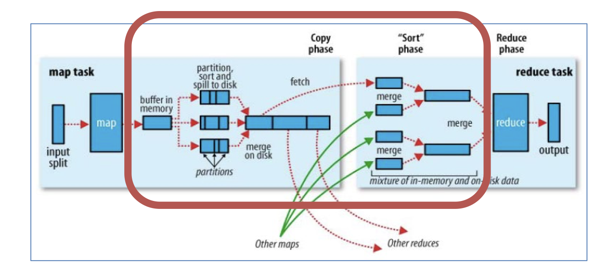
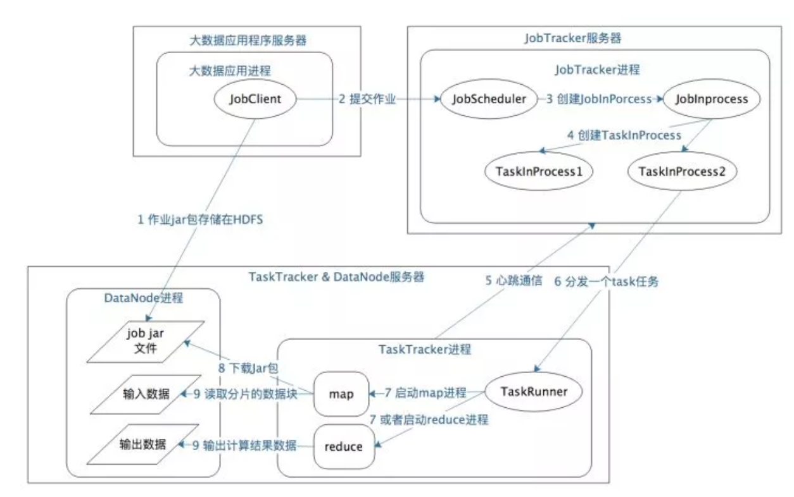

 						 						 						 			**MapReduce定义**

MapReduce是一个分布式运算程序的编程框架，是用户开发“基于Hadoop的数据分析应用”的核心框架。 MapReduce核心功能是将用户编写的业务逻辑代码和自带默认组件整合成一个完整的分布式运算程序，并发运行在一个Hadoop集群上。 

 						 					

**MapReduce的优点**

\1. MapReduce易于编程

只需要实现一些简单接口，就可以完成一个分布式程序，这个分布式程序可以分布到大量廉价的PC机器上运行。也就是说你写一个分布式程序，就跟写一个简单的串行程序是一模一样的。

\2. 良好的扩展性（hadoop的特点）

当你的计算资源不能满足的时候，你可以通过简单的增加机器（nodemanager）来扩展它的计算能力

\3. 高容错性

MapReduce设计的初衷就是使程序能够部署在廉价的PC机器上，这就要求它具有很高的容错性，比如其中一台机器挂了，它可以把上面的计算任务转移到另外一个节点上运行，不至于整个任务运行失败。

\4. 适合PB级以上海量数据的离线处理

可以实现上千台服务器集群并发工作，提供数据处理能力

**MapReduce的缺点**

\1. 不擅长实时计算

MapReduce无法像MySQL一样，在毫秒或者秒级内返回结果

\2. 不擅长流式计算

流式计算的输入数据是动态的，而MapReduce的输入数据集是静态的，不能动态变化。这是因为MapReduce自身的设计特点决定了数据源必须是静态的

\3. 不擅长DAG有向图计算

多个应用程序之间存在依赖关系，后一个应用程序的输入为前一个程序的输出。在这种情况下，每个MapReduce作业的输出结果都会写入到磁盘，会造成大量的磁盘IO，导致性能非常低下

# MapReduce 编程模型

### **MapReduce 的工作流程**

大致可以分为5步，具体如下:

 		

**分片、格式化数据源**

输入 Map 阶段的数据源，必须经过分片和格式化操作。

分片操作：指的是将源文件划分为大小相等的小数据块( Hadoop 2.x 中默认 128MB )，也就是分片( split )，

Hadoop 会为每一个分片构建一个 Map 任务，并由该任务运行自定义的 map() 函数，从而处理分片里的每一条记录;

格式化操作：将划分好的分片( split )格式化为键值对<key,value>形式的数据，其中， key 代表偏移量， value 代表每一行内容。

**执行 MapTask**

每个 Map 任务都有一个内存缓冲区(缓冲区大小 100MB )，输入的分片( split )数据经过 Map 任务处理后的中间结果会写入内存缓冲区中。

如果写人的数据达到内存缓冲的阈值( 80MB )，会启动一个线程将内存中的溢出数据写入磁盘，同时不影响 Map 中间结果继续写入缓冲区。

在溢写过程中， MapReduce 框架会对 key 进行排序，如果中间结果比较大，会形成多个溢写文件，最后的缓冲区数据也会全部溢写入磁盘形成一个溢写文件，如果是多个溢写文件，则最后合并所有的溢写文件为一个文件。

**执行 Shuffle 过程**

MapReduce 工作过程中， Map 阶段处理的数据如何传递给 Reduce 阶段，这是 MapReduce 框架中关键的一个过程，这个过程叫作 Shuffle 。

Shuffle 会将 MapTask 输出的处理结果数据分发给 ReduceTask ，并在分发的过程中，对数据按 key 进行分区和排序。

**执行 ReduceTask**

输入 ReduceTask 的数据流是<key, {value list}>形式，用户可以自定义 reduce()方法进行逻辑处理，最终以<key, value>的形式输出。

**写入文件**

MapReduce 框架会自动把 ReduceTask 生成的<key, value>传入 OutputFormat 的 write 方法，实现文件的写入操作。

### MapTask

**Read 阶段**： MapTask 通过用户编写的 RecordReader ，从输入的 InputSplit 中解析出一个个 key / value 。

**Map 阶段**：将解析出的 key / value 交给用户编写的 Map ()函数处理，并产生一系列新的 key / value 。

**Collect 阶段**：在用户编写的 map() 函数中，数据处理完成后，一般会调用 outputCollector.collect() 输出结果，在该函数内部，它会将生成的 key / value 分片(通过调用 partitioner )，并写入一个环形内存缓冲区中(该缓冲区默认大小是 100MB )。

**Spill 阶段**：即“溢写”，当缓冲区快要溢出时(默认达到缓冲区大小的 80 %)，会在本地文件系统创建一个溢出文件，将该缓冲区的数据写入这个文件。

**Combine 阶段**：当所有数据处理完成以后， MapTask 会对所有临时文件进行一次合并，以确保最终只会生成一个数据文件

### ReduceTask

**Copy 阶段**： Reduce 会从各个 MapTask 上远程复制一片数据（每个 MapTask 传来的数据都是有序的），并针对某一片数据，如果其大小超过一定國值，则写到磁盘上，否则直接放到内存中

**Merge 阶段**：在远程复制数据的同时， ReduceTask 会启动两个后台线程，分别对内存和磁盘上的文件进行合并，以防止内存使用过多或者磁盘文件过多。

**Sort 阶段**：用户编写 reduce() 方法输入数据是按 key 进行聚集的一组数据。

**Reduce 阶段**：对排序后的键值对调用 reduce() 方法，键相等的键值对调用一次 reduce()方法，每次调用会产生零个或者多个键值对，最后把这些输出的键值对写入到 HDFS 中

**Write 阶段**： reduce() 函数将计算结果写到 HDFS 上。

wordcount实例过程：

[https://blog.csdn.net/universe_ant/article/details/52624867?ops_request_misc=&request_id=&biz_id=102&utm_term=mapreduce%20word&utm_medium=distribute.pc_search_result.none-task-blog-2~all~sobaiduweb~default-0-52624867.first_rank_v2_pc_rank_v29&spm=1018.2226.3001.4187](https://blog.csdn.net/universe_ant/article/details/52624867?ops_request_misc=&request_id=&biz_id=102&utm_term=mapreduce word&utm_medium=distribute.pc_search_result.none-task-blog-2~all~sobaiduweb~default-0-52624867.first_rank_v2_pc_rank_v29&spm=1018.2226.3001.4187)

https://github.com/wangzhiwubigdata/God-Of-BigData/blob/master/%E5%A4%A7%E6%95%B0%E6%8D%AE%E6%A1%86%E6%9E%B6%E5%AD%A6%E4%B9%A0/Hadoop-MapReduce.md

# MapReduce处理流程（详细）

 	 	 					 					 					 					 					 					 					 					 					 				

**输入文件** 

首先，MapReduce 任务的目的是处理数据，那数据从哪里来?一般一个 MapReduce 任务的输入数据是来自于 HDFS 文件，这里的数据文件就叫做 MapReduce 任务的输入文件，而 HDFS 上文件的格式多种多样，比如有文本文件， 二进制文件等。 

**InputFormat** 

InputFormat 是 MapReduce 框架的一个类，它对输入文件进行分割和读取，并创建 数据分片 InputSplit。 

**InputSplit** 

InputSplit 对象即数据分片对象，由 InputFormat 生成的，一个数据分片由一个 Mapper 来处理，数据分片是逻辑上的划分，并非物理分割。每一个分片都会相应创 建一个 map 任务，因此，map 任务的数量等于分片的数量，即有多少个分片就有多 少个 map 任务。分片会被划分成记录，并且每个记录都会被对应 mapper 处理。 

**RecordReader** 

它会跟 InputSplit 交互，并把数据转换成适合 mapper 读取的键值对(key-value pair)记录。默认情况下，它用的是 TextInputFormat 类来做转换。RecordReader 与 InputSplit 交互一直到文件读取完成。它会给文件的每一行数据分配一个字节偏移 量(byte offset)作为唯一编号。后续这些键值对将被发送给 mapper 做进一步处 理。 

**Mapper** 		 					 					 					 					 					 					 					 					 					 					 					 					 				

它负责处理每一个来自 RecordReader 的记录，并生成新的键值对数据，这些 Mapper 新生成的键值对跟输入键值对是不一样的。Mapper 的输出也就是我们前面说的中间结果将会被写到本地磁盘。Mapper 的输出数据并不是存储在 HDFS 的， 因为这是临时数据，如果把临时数据写到 HDFS ，将造成不必要的复制，会导致 map 任务性能低下。Mapper 的输出数据被传输给 Combiner 做下一步处理。 

**Combiner** 

combiner 其实是一种 reduce 操作。它会对 mapper 的输出数据做本地聚合，也就 是说它是在输出数据的 mapper 所在的机器上执行的。主要为了减少 mapper 和 reducer 之间的数据传输。combiner 执行完成之后，它的输出结果就会被传输到 partitioner 做下一步处理。 

**Partitioner** 

如果一个 MapReduce 作业在 reduce 阶段有多个 reducer 任务参与，才会有 Partitioner 这一步，即数据分区。如果只有一个 reducer 任务，Partitioner 是不会执行的，即不会对数据分区。
Partitioner 对来自 combiner 的输出数据分区并排序，其实就是对数据的 key 做哈希运算，具有相同 key 的记录会被分到相同的分区，然后每个分区会被发送给 reducer。 

**Shuffle** 和排序
现在，Partitioner 的输出被 shuffle 到 reduce 节点( 这里的 reduce 节点其实就是正常的 slave 节点，由于在上面跑 reduce 任务所以才叫 reduce 节点)。shuffle 是对数据进行跨网络的物理移动，需要消耗网络带宽资源。在所有 mapper都完成之后，他们的输出数据才会被 shuffle 到 reduce 节点，并且这些 mapper 产生 的数据会被合并和排序，然后作为 reduce 阶段的输入数据。 

**Map端Shuffle**

Collect阶段：将MapTask的结果收集输出到默认大小为100M的环形缓冲区，保存之前会对key进行分区的计算， 默认Hash分区。

Spill阶段：当内存中的数据量达到一定的阀值的时候，就会将数据写入本地磁盘，在将数据写入磁盘之前需要对数据进行一次排序的操作，如果配置了combiner，还会将有相同分区号和key的数据进行排序。 

Merge阶段：把所有溢出的临时文件进行一次合并操作，以确保一个MapTask最终只产生一个中间数据文件。

**Reducer端shuffle**

Copy阶段： ReduceTask启动Fetcher线程到已经完成MapTask的节点上复制一份属于自己的数据。 

Merge阶段：在ReduceTask远程复制数据的同时，会在后台开启两个线程对内存到本地的数据文件进行合并操作 。 

Sort阶段：在对数据进行合并的同时，会进行排序操作，由于MapTask阶段已经对数据进行了局部的排序， ReduceTask只需保证Copy的数据的最终整体有效性即可。

我们对于MR作业的shuffle过程的期望是：
1，将Map的输出数据完整地传输到Reduce端。
2，在传输数据时，尽可能得减少不必要的带宽消耗。
3，降低磁盘I/O的影响。

**Reducer** 

在 reduce 阶段，它把 mapper 输出的键值对数据作为输入，然后对每个键值对数据 记录应用 reducer 函数并输出结果。reducer 的输出数据是 MapReduce 作业的最 终计算结果，它会被存储到 HDFS。 

**RecordWrite** 

它负责把来自 Reducer 输出的键值对数据写到输出文件。 

**OutputFormat** 		

RecordWriter 将 Reducer 输出的键值对写入输出文件的方式由 OutputFormat 决 定。OutputFormat 是由 Hadoop 提供的用于把数据写到 HDFS 或者本地磁盘的接 口。因此，reducer 的最终输出数据是由 Outputformat 实例负责写入到 HDFS 的。 

# MapReduce作业启动和运行机制

MapReduce运行过程涉及以下几类关键进程：

- 大数据应用进程：启动用户MapReduce程序的主入口，主要指定Map和Reduce类、输入输出文件路径等，并提交作业给Hadoop集群。
- JobTracker进程：根据要处理的输入数据量启动相应数量的map和reduce进程任务，并管理整个作业生命周期的任务调度和监控。JobTracker进程在整个Hadoop集群全局唯一。
- TaskTracker进程：负责启动和管理map进程以及reduce进程。因为需要每个数据块都有对应的map函数，TaskTracker进程通常和HDFS的DataNode进程启动在同一个服务器，也就是说，Hadoop集群中绝大多数服务器同时运行DataNode进程和TaskTacker进程。

具体作业启动和计算过程如下：

- 应用进程将用户作业jar包存储在HDFS中，将来这些jar包会分发给Hadoop集群中的服务器执行MapReduce计算。
- 应用程序提交job作业给JobTracker。
- JobTacker根据作业调度策略创建JobInProcess树，每个作业都会有一个自己的JobInProcess树。
- JobInProcess根据输入数据分片数目（通常情况就是数据块的数目）和设置的reduce数目创建相应数量的TaskInProcess。
- TaskTracker进程和JobTracker进程进行定时通信。
- 如果TaskTracker有空闲的计算资源（空闲CPU核），JobTracker就会给他分配任务。分配任务的时候会根据TaskTracker的服务器名字匹配在同一台机器上的数据块计算任务给它，使启动的计算任务正好处理本机上的数据。
- TaskRunner收到任务后根据任务类型（map还是reduce），任务参数（作业jar包路径，输入数据文件路径，要处理的数据在文件中的起始位置和偏移量，数据块多个备份的DataNode主机名等）启动相应的map或者reduce进程。
- map或者reduce程序启动后，检查本地是否有要执行任务的jar包文件，如果没有，就去HDFS上下载，然后加载map或者reduce代码开始执行。
- 如果是map进程，从HDFS读取数据（通常要读取的数据块正好存储在本机）。如果是reduce进程，将结果数据写出到HDFS。

# Hadoop 数据类型 

 					 					 				

**什么是 Task Attempt** 

Task Attempt，即任务尝试。集群的机器在任何时间都可能发生故障，比如，正在处 理数据的机器挂了，MapReduce 把任务重新调度到其他机器节点。当然这里的重新 调度次数并非不受限制的，它是有上限的，默认是 4 次，如果一个任务(Mapper 任 务或者 Reducer 任务)失败 4 次，那么整个 Job 就被认为失败了。对于高优先级 的作业或者大型作业，这个值可以调高一点。 