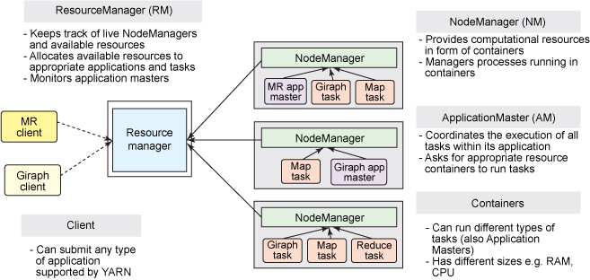
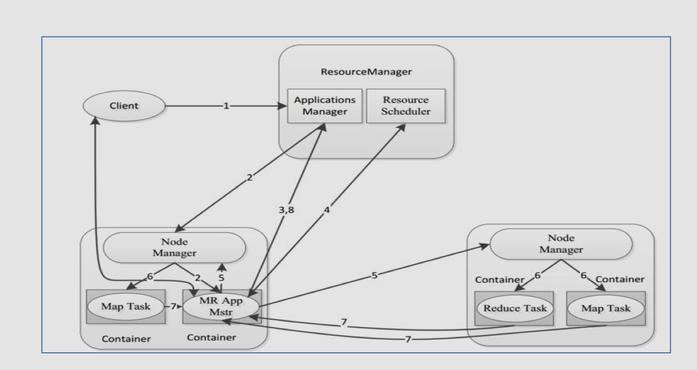
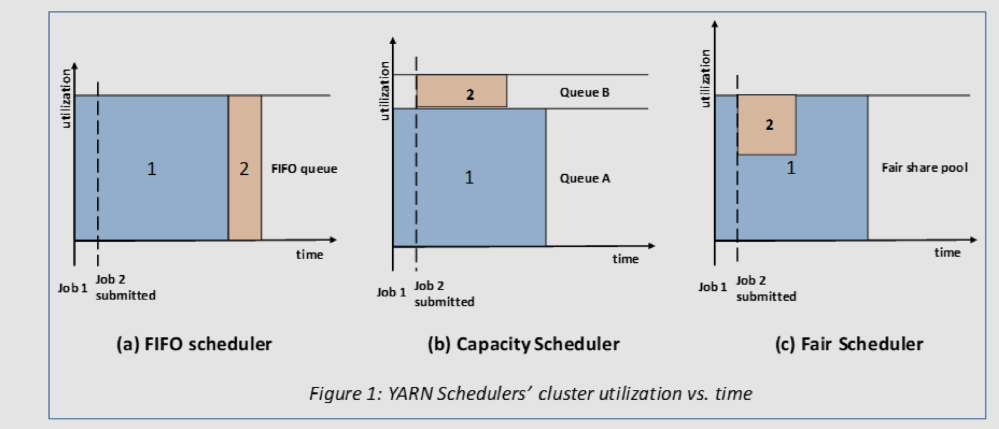
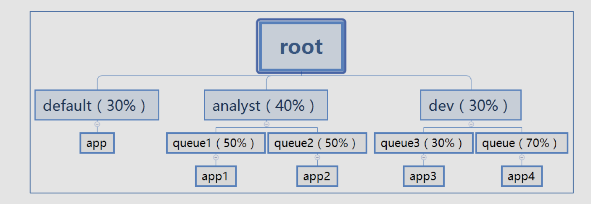

## 一、hadoop yarn 简介

**Apache YARN** (Yet Another Resource Negotiator) 是 hadoop 2.0 引入的集群资源管理系统。用户可以将各种服务框架部署在 YARN 上，由 YARN 进行统一地管理和资源分配。

## 二、YARN架构

### 1. ResourceManager

`ResourceManager` 通常在独立的机器上以后台进程的形式运行，它是整个集群资源的主要协调者和管理者。`ResourceManager` 负责给用户提交的所有应用程序分配资源，它根据应用程序优先级、队列容量、ACLs、数据位置等信息，做出决策，然后以共享的、安全的、多租户的方式制定分配策略，调度集群资源。

### 2. NodeManager

`NodeManager` 是 YARN 集群中的每个具体节点的管理者。主要负责该节点内所有容器的生命周期的管理，监视资源和跟踪节点健康。具体如下：

- 启动时向 `ResourceManager` 注册并定时发送心跳消息，等待 `ResourceManager` 的指令；
- 维护 `Container` 的生命周期，监控 `Container` 的资源使用情况；
- 管理任务运行时的相关依赖，根据 `ApplicationMaster` 的需要，在启动 `Container` 之前将需要的程序及其依赖拷贝到本地。

### 3. ApplicationMaster

在用户提交一个应用程序时，YARN 会启动一个轻量级的进程 `ApplicationMaster`。`ApplicationMaster` 负责协调来自 `ResourceManager` 的资源，并通过 `NodeManager` 监视容器内资源的使用情况，同时还负责任务的监控与容错。具体如下：

- 根据应用的运行状态来决定动态计算资源需求；
- 向 `ResourceManager` 申请资源，监控申请的资源的使用情况；
- 跟踪任务状态和进度，报告资源的使用情况和应用的进度信息；
- 负责任务的容错。

### 4. Container

`Container` 是 YARN 中的资源抽象，它封装了某个节点上的多维度资源，如内存、CPU、磁盘、网络等。当 AM 向 RM 申请资源时，RM 为 AM 返回的资源是用 `Container` 表示的。YARN 会为每个任务分配一个 `Container`，该任务只能使用该 `Container` 中描述的资源。`ApplicationMaster` 可在 `Container` 内运行任何类型的任务。例如，`MapReduce ApplicationMaster` 请求一个容器来启动 map 或 reduce 任务，而 `Giraph ApplicationMaster` 请求一个容器来运行 Giraph 任务。

## 三、YARN工作原理简述

1. `Client` 提交作业到 YARN 上；
2. `Resource Manager` 选择一个 `Node Manager`，启动一个 `Container` 并运行 `Application Master` 实例；
3. `Application Master` 根据实际需要向 `Resource Manager` 请求更多的 `Container` 资源（如果作业很小, 应用管理器会选择在其自己的 JVM 中运行任务）；
4. `Application Master` 通过获取到的 `Container` 资源执行分布式计算。

## 四、YARN工作原理详述

#### 1. 作业提交

client 调用 job.waitForCompletion 方法，向整个集群提交 MapReduce 作业 (第 1 步) 。新的作业 ID(应用 ID) 由资源管理器分配 (第 2 步)。作业的 client 核实作业的输出, 计算输入的 split, 将作业的资源 (包括 Jar 包，配置文件, split 信息) 拷贝给 HDFS(第 3 步)。 最后, 通过调用资源管理器的 submitApplication() 来提交作业 (第 4 步)。

#### 2. 作业初始化

当资源管理器收到 submitApplciation() 的请求时, 就将该请求发给**调度器 (scheduler),** 调度器分配 container, 然后资源管理器在该 container 内启动应用管理器进程, 由节点管理器监控 (第 5 步)。

MapReduce 作业的应用管理器是一个主类为 MRAppMaster 的 Java 应用，其通过创造一些 bookkeeping 对象来监控作业的进度, 得到任务的进度和完成报告 (第 6 步)。然后其通过分布式文件系统得到由客户端计算好的输入 split(第 7 步)，然后为每个输入 split 创建一个 map 任务, 根据 mapreduce.job.reduces 创建 reduce 任务对象。

#### 3. 任务分配

如果作业很小, 应用管理器会选择在其自己的 JVM 中运行任务。

如果不是小作业, 那么应用管理器向资源管理器请求 container 来运行所有的 map 和 reduce 任务 (第 8 步)。这些请求是通过心跳来传输的, 包括每个 map 任务的数据位置，比如存放输入 split 的主机名和机架 (rack)，调度器利用这些信息来调度任务，尽量将任务分配给存储数据的节点, 或者分配给和存放输入 split 的节点相同机架的节点。

#### 4. 任务运行

当一个任务由资源管理器的调度器分配给一个 container 后，应用管理器通过联系节点管理器来启动 container(第 9 步)。任务由一个主类为 YarnChild 的 Java 应用执行， 在运行任务之前首先本地化任务需要的资源，比如作业配置，JAR 文件, 以及分布式缓存的所有文件 (第 10 步。 最后, 运行 map 或 reduce 任务 (第 11 步)。

YarnChild 运行在一个专用的 JVM 中, 但是 YARN 不支持 JVM 重用。

#### 5. 进度和状态更新

YARN 中的任务将其进度和状态 (包括 counter) 返回给应用管理器, 客户端每秒 (通 mapreduce.client.progressmonitor.pollinterval 设置) 向应用管理器请求进度更新, 展示给用户。

#### 6. 作业完成

除了向应用管理器请求作业进度外, 客户端每 5 分钟都会通过调用 waitForCompletion() 来检查作业是否完成，时间间隔可以通过 mapreduce.client.completion.pollinterval 来设置。作业完成之后, 应用管理器和 container 会清理工作状态， OutputCommiter 的作业清理方法也会被调用。作业的信息会被作业历史服务器存储以备之后用户核查。

## 五、YARN资源调度器Scheduler

在YARN中，负责给应用分配资源的就是Scheduler，它是ResourceManager的核心组件之一。Scheduler完全专用于调度作业，它无法跟踪应用程序的状态。

在YARN中，负责给应用分配资源的就是Scheduler，它是ResourceManager的核心组件之一。

Scheduler完全专 用于调度作业，它无法跟踪应用程序的状态。 一般而言，调度是一个难题，并且没有一个“最佳”策略，为此，YARN提供了多种调度器和可配置的策略供选择

### 调度器策略

三种调度器 **FIFO Scheduler（先进先出调度器）、Capacity Scheduler（容量调度器）、Fair Scheduler（公平调度器）。**  Apache版本YARN默认使用Capacity Scheduler。 

Apache版本YARN默认使用Capacity Scheduler。 如果需要使用其他的调度器，可以在yarn-site.xml中的yarn.resourcemanager.scheduler.class进行配置。

#### FIFO Scheduler概述

FIFO Scheduler是一个先进先出的思想，即先提交的应用先运行。

调度工作不考虑优先级和范围，适用于负载较低的小规模集群。当使用大型共享集群时，它的效率较低且会导致一些问题。

 FIFO Scheduler拥有一个控制全局的队列queue，默认queue名称为default，该调度器会获取当前集群上所有的 资源信息作用于这个全局的queue。

优势： 无需配置、先到先得、易于执行 

坏处： 任务的优先级不会变高，因此高优先级的作业需要等待 不适合共享集群

#### Capacity Scheduler概述

Capacity Scheduler容量调度是Apache Hadoop3.x默认调度策略。

该策略允许多个组织共享整个集群资源，每个组织可以获得集群的一部分计算能力。通过为每个组织分配专门的队列，然后再为每个队列分配一定的集群资源， 这样整个集群就可以通过设置多个队列的方式给多个组织提供服务了。 Capacity可以理解成一个个的资源队列，这个资源队列是用户自己去分配的。队列内部又可以垂直划分，这样一个 组织内部的多个成员就可以共享这个队列资源了，在一个队列内部，资源的调度是采用的是先进先出(FIFO)策略。

Capacity Scheduler调度器以队列为单位划分资源。简单通俗点来说，就是一个个队列有独立的资源，队列的结构 和资源是可以进行配置的。

**Capacity Scheduler特性优势**

层次化的队列设计（Hierarchical Queues） 层次化的管理，可以更容易、更合理分配和限制资源的使用。

容量保证（Capacity Guarantees） 每个队列上都可以设置一个资源的占比，保证每个队列都不会占用整个集群的资源。

安全（Security） 每个队列有严格的访问控制。用户只能向自己的队列里面提交任务，而且不能修改或者访问其他队列的任务。

弹性分配（Elasticity） 空闲的资源可以被分配给任何队列。 当多个队列出现争用的时候，则会按照权重比例进行平衡。

#### Fair Scheduler概述

Fair Scheduler叫做公平调度，提供了YARN应用程序公平地共享大型集群中资源的另一种方式。

使所有应用在平均情况下随着时间的流逝可以获得相等的资源份额。 Fair Scheduler设计目标是为所有的应用分配公平的资源（对公平的定义通过参数来设置）。 公平调度可以在多个队列间工作，允许资源共享和抢占。

如何理解公平共享

有两个用户A和B，每个用户都有自己的队列。 A启动一个作业，由于没有B的需求，它分配了集群所有可用的资源。 然后B在A的作业仍在运行时启动了一个作业，经过一段时间，A,B各自作业都使用了一半的资源。 现在，如果B用户在其他作业仍在运行时开始第二个作业，它将与B的另一个作业共享其资源，因此B的每个作业将 拥有资源的四分之一，而A的继续将拥有一半的资源。结果是资源在用户之间公平地共享。

**Fair Scheduler特性优势**

分层队列：队列可以按层次结构排列以划分资源，并可以配置权重以按特定比例共享集群。 

基于用户或组的队列映射：可以根据提交任务的用户名或组来分配队列。如果任务指定了一个队列,则在该队列中 提交任务。 

资源抢占：根据应用的配置，抢占和分配资源可以是友好的或是强制的。默认不启用资源抢占。

保证最小配额：可以设置队列最小资源，允许将保证的最小份额分配给队列，保证用户可以启动任务。当队列不能 满足最小资源时,可以从其它队列抢占。当队列资源使用不完时,可以给其它队列使用。这对于确保某些用户、组或 生产应用始终获得足够的资源。 

允许资源共享：即当一个应用运行时,如果其它队列没有任务执行,则可以使用其它队列,当其它队列有应用需要资源 时再将占用的队列释放出来。所有的应用都从资源队列中分配资源。 

默认不限制每个队列和用户可以同时运行应用的数量。可以配置来限制队列和用户并行执行的应用数量。限制并行 执行应用数量不会导致任务提交失败,超出的应用会在队列中等待。