## Zookeeper简介

Zookeeper是一个**分布式协调服务**的开源框架，它是由Google的Chubby开源实现。Zookeeper主要用来解决分布式集群中应用系统的一致性问题，例如如何避免同时操作同一数据造成脏读的问题等。

Zookeeper 本质上是一个分布式的小文件存储系统。 提供基于类似于文件系统的目录树方式的数据存储，并且可以对树中的节点进行有效管理。从而用来维护和监控你存储的数据的状态变化。通过监控这些数据状态的变化，从而可以达到基于数据的集群管理。 

**Zookeeper的典型应用场景**

**数据的发布/订阅**

数据的发布/订阅系统，通常也用作配置中心。在分布式系统中，你可能有成千上万个服务节点，如果想要对所有服务的某项配置进行更改，由于数据节点过多，你不可逐台进行修改，而应该在设计时采用统一的配置中心。之后发布者只需要将新的配置发送到配置中心，所有服务节点即可自动下载并进行更新，从而实现配置的集中管理和动态更新。

Zookeeper 通过 Watcher 机制可以实现数据的发布和订阅。分布式系统的所有的服务节点可以对某个 ZNode 注册监听，之后只需要将新的配置写入该 ZNode，所有服务节点都会收到该事件。

**命名服务**

在分布式系统中，通常需要一个全局唯一的名字，如生成全局唯一的订单号等，Zookeeper 可以通过顺序节点的特性来生成全局唯一 ID，从而可以对分布式系统提供命名服务。

**Master选举**

分布式系统一个重要的模式就是主从模式 (Master/Salves)，Zookeeper 可以用于该模式下的 Matser 选举。可以让所有服务节点去竞争性地创建同一个 ZNode，由于 Zookeeper 不能有路径相同的 ZNode，必然只有一个服务节点能够创建成功，这样该服务节点就可以成为 Master 节点。

**分布式锁**

可以通过 Zookeeper 的临时节点和 Watcher 机制来实现分布式锁，这里以排它锁为例进行说明：

分布式系统的所有服务节点可以竞争性地去创建同一个临时 ZNode，由于 Zookeeper 不能有路径相同的 ZNode，必然只有一个服务节点能够创建成功，此时可以认为该节点获得了锁。其他没有获得锁的服务节点通过在该 ZNode 上注册监听，从而当锁释放时再去竞争获得锁。锁的释放情况有以下两种：

- 当正常执行完业务逻辑后，客户端主动将临时 ZNode 删除，此时锁被释放；
- 当获得锁的客户端发生宕机时，临时 ZNode 会被自动删除，此时认为锁已经释放。

当锁被释放后，其他服务节点则再次去竞争性地进行创建，但每次都只有一个服务节点能够获取到锁，这就是排他锁。

**集群管理**

Zookeeper 还能解决大多数分布式系统中的问题：

- 如可以通过创建临时节点来建立心跳检测机制。如果分布式系统的某个服务节点宕机了，则其持有的会话会超时，此时该临时节点会被删除，相应的监听事件就会被触发。
- 分布式系统的每个服务节点还可以将自己的节点状态写入临时节点，从而完成状态报告或节点工作进度汇报。
- 通过数据的订阅和发布功能，Zookeeper 还能对分布式系统进行模块的解耦和任务的调度。
- 通过监听机制，还能对分布式系统的服务节点进行动态上下线，从而实现服务的动态扩容。

### ZooKeeper是怎么做到的？（回看）

#### 统一配置管理

比如我们现在有三个系统A、B、C，他们有三份配置，分别是`ASystem.yml、BSystem.yml、CSystem.yml`，然后，这三份配置又非常类似，很多的配置项几乎都一样。

- 此时，如果我们要改变其中一份配置项的信息，很可能其他两份都要改。并且，改变了配置项的信息**很可能就要重启系统**

于是，我们希望把`ASystem.yml、BSystem.yml、CSystem.yml`相同的配置项抽取出来成一份**公用**的配置`common.yml`，并且即便`common.yml`改了，也不需要系统A、B、C重启。

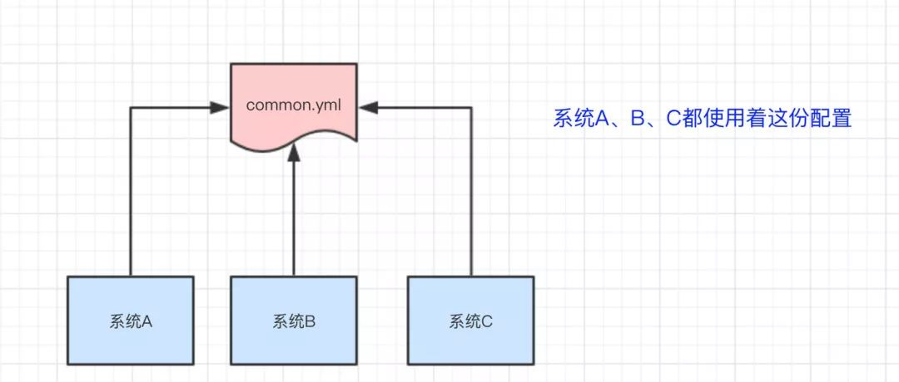系统A、B、C都使用着这份配置

做法：我们可以将`common.yml`这份配置放在ZooKeeper的Znode节点中，系统A、B、C监听着这个Znode节点有无变更，如果变更了，**及时**响应。

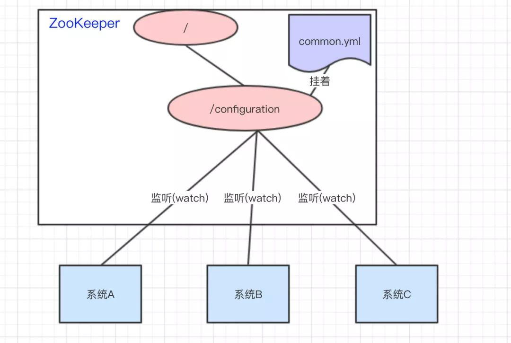系统A、B、C监听着ZooKeeper的节点，一旦common.yml内容有变化，及时响应

#### 统一命名服务

统一命名服务的理解其实跟**域名**一样，是我们为这某一部分的资源给它**取一个名字**，别人通过这个名字就可以拿到对应的资源。

比如说，现在我有一个域名`www.java3y.com`，但我这个域名下有多台机器：

- 192.168.1.1
- 192.168.1.2
- 192.168.1.3
- 192.168.1.4

别人访问`www.java3y.com`即可访问到我的机器，而不是通过IP去访问。

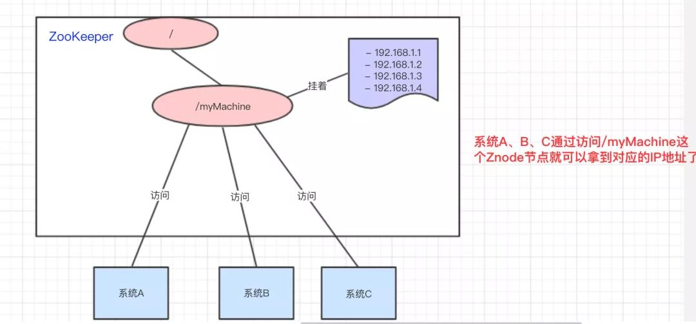通过名称去访问旗下的IP


#### 分布式锁

锁的概念在这我就不说了，如果对锁概念还不太了解的同学，可参考下面的文章

我们可以使用ZooKeeper来实现分布式锁，那是怎么做的呢？？下面来看看：

系统A、B、C都去访问`/locks`节点

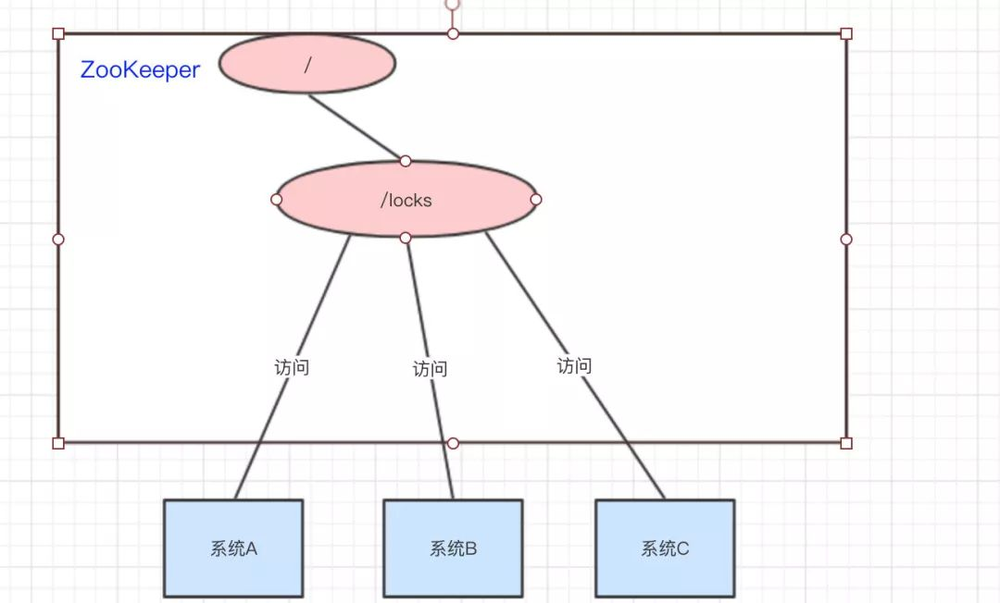系统A、B、C都去访问locks节点

访问的时候会创建**带顺序号的临时/短暂**(`EPHEMERAL_SEQUENTIAL`)节点，比如，系统A创建了`id_000000`节点，系统B创建了`id_000002`节点，系统C创建了`id_000001`节点。

创建出临时带顺序号的节点

接着，拿到`/locks`节点下的所有子节点(id_000000,id_000001,id_000002)，**判断自己创建的是不是最小的那个节点**

- 如果是，则拿到锁。

- - 释放锁：执行完操作后，把创建的节点给删掉

- 如果不是，则监听比自己要小1的节点变化

#### 集群状态

经过上面几个例子，我相信大家也很容易想到ZooKeeper是怎么"**感知**"节点的动态新增或者删除的了。

还是以我们三个系统A、B、C为例，在ZooKeeper中创建**临时节点**即可：

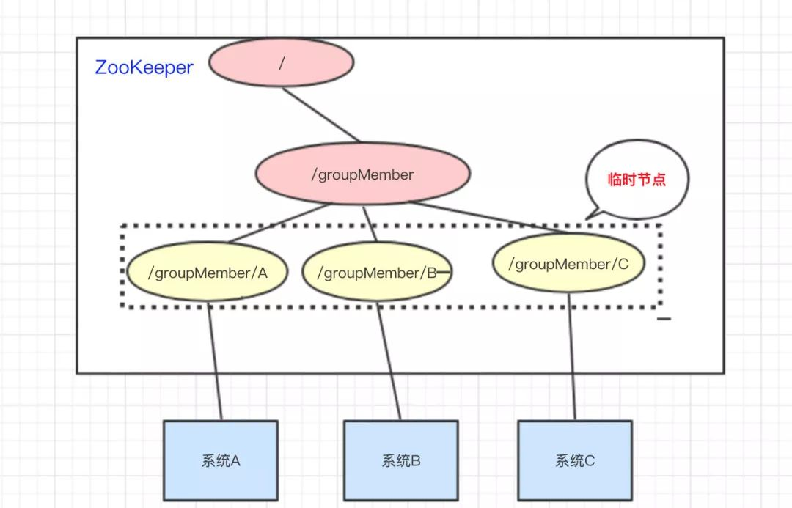各维护一个临时节点

只要系统A挂了，那`/groupMember/A`这个节点就会删除，通过**监听**`groupMember`下的子节点，系统B和C就能够感知到系统A已经挂了。(新增也是同理)

除了能够感知节点的上下线变化，ZooKeeper还可以实现**动态选举Master**的功能。(如果集群是主从架构模式下)

原理也很简单，如果想要实现动态选举Master的功能，Znode节点的类型是带**顺序号的临时节点**(`EPHEMERAL_SEQUENTIAL`)就好了。

- Zookeeper会每次选举最小编号的作为Master，如果Master挂了，自然对应的Znode节点就会删除。然后让**新的最小编号作为Master**，这样就可以实现动态选举的功能了。


### Zookeeper的特性

Zookeeper具有全局数据一致性、可靠性、顺序性、原子性以及实时性，可以说Zookeeper的其他特性都是为满足Zookeeper全局数据一致性这一特性。具体介绍如下：

**1．全局数据一致**

每个服务器都保存一份相同的数据副本，客户端无论连接到集群的任意节点上，看到的目录树都是一致的（也就是数据都是一致的），这也是Zookeeper最重要的特征。

**2．可靠性**

如果消息（对目录结构的增删改查）被其中一台服务器接收，那么将被所有的服务器接收。节点更新以后，在下次更新之前，它的数据不会发生变更；

**3．顺序性**

Zookeeper顺序性主要分为全局有序和偏序两种，其中全局有序是指如果在一台服务器上消息A在消息B前发布，则在所有服务器上消息A都将在消息B前被发布；偏序是指如果一个消息B在消息A后被同一个发送者发布，A必将排在B前面。无论全局有序还是偏序，其目的都是为了保证Zookeeper全局数据一致。

**4．数据更新原子性**

一次数据更新要么成功（半数以上节点成功），要么失败，不存在中间状态。

**5．实时性**

Zookeeper保证客户端将在一个时间间隔范围内获得服务器的更新信息，或者服务器失效的信息。

## Zookeeper集群架构

Zookeeper对外提供一个类似于文件系统的层次化的数据存储服务，为了保证整个Zookeeper集群的容错性和高性能，每一个Zookeeper集群都是由多台服务器节点（Server）组成，这些节点通过复制保证各个服务器节点之间的数据一致。只要当这些服务器节点过半数节点可用，那么整个Zookeeper集群就可用。

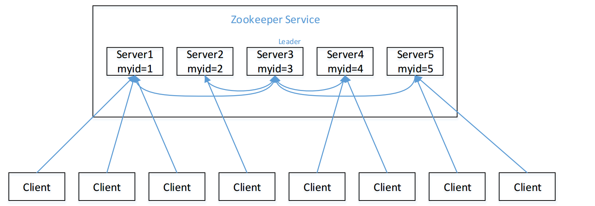

Zookeeper集群是一个主从集群，它一般是由一个**Leader（领导者）**和多个**Follower（跟随者）**组成。此外，针对访问量比较大的Zookeeper集群，还可新增**Observer（观察者）**。

**1．Leader**

它是Zookeeper集群工作的核心，也是事务性请求（写操作）的唯一调度和处理者，它保证集群事务处理的顺序性，同时负责进行投票的发起和决议，以及更新系统状态。

**2．Follower**

它负责处理客户端的非事务（读操作）请求，如果接收到客户端发来的事务性请求，则会转发给Leader，让Leader进行处理，同时还负责在Leader选举过程中参与投票。

**3．Observer**

它负责观察Zookeeper集群的最新状态的变化，并且将这些状态进行同步。对于非事务性请求可以进行独立处理；对于事务性请求，则会转发给Leader服务器进行处理。它不会参与任何形式的投票，只提供非事务性的服务，通常用于在不影响集群事务处理能力的前提下，提升集群的非事务处理能力（提高集群读的能力，也降低了集群选主的复杂程度）。

## Zookeeper的数据模型

### 存储结构

Zookeeper中数据存储的结构和标准文件系统非常类似，拥有一个层次的命名空间，也是使用斜杠（/）进行分割，两者都是采用树形层次结构。不同的是，标准文件系统是由文件夹和文件来组成的树，Zookeeper是由节点组成的树，树中的每个节点被称为—**Znode**。znode既可以作为保存数据的容器(如同文件),也可以作为保存其他znode的容器(如同目录)。

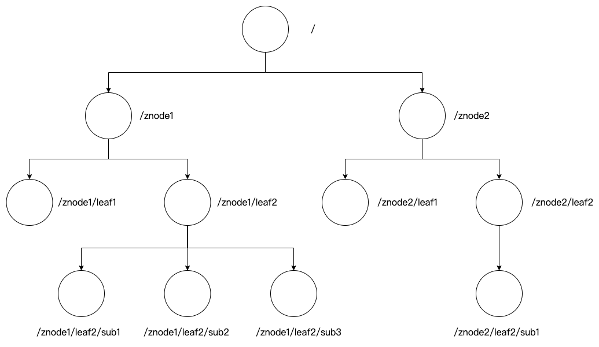

- Zookeeper被设计用来实现协调服务，这类服务通常使用小数据文件，而不是用于大容量数据存储，因此一个znode能存储的数据被限制在1MB以内，
- 每个znode都可以通过其路径唯一标识。

Zookeeper数据模型中的每个Znode都是由四部分组成，分别是**stat（状态信息，描述该Znode的版本，权限信息等组成）、data（与该Znode关联的数据）、children（该Znode下的子节点），ACL（权限，定义了什么样的⽤户能够操作这个节点，且能够进⾏怎样的操作。）。**

### Znode的类型

Znode有两种类型，分别是**临时节点和永久节点。**

**临时节点**，该生命周期依赖于创建它们的会话，一旦会话结束，临时节点将会被自动删除，当然也可以手动删除。虽然每个临时的Znode都会绑定到一个客户端，但它们对所有的客户端还是可见的。另外，需要注意的是临时节点不允许拥有子节点。

**永久节点**，该生命周期不依赖于会话，并且只有在客户端显示执行删除操作的时候，它们才能被删除。

由于Znode的序列化特性，在创建节点时，用户可以请求在该Znode的路径结尾添加一个不断增加的序列号，序列号对于此节点的父节点来说是唯一的，这样便会记录每个子节点创建的先后顺序。它的格式为“%010d”（10位数字，没有数值的数位用0补充，例如“0000000001”）。当计数值大于232-1时，计数器将会溢出。

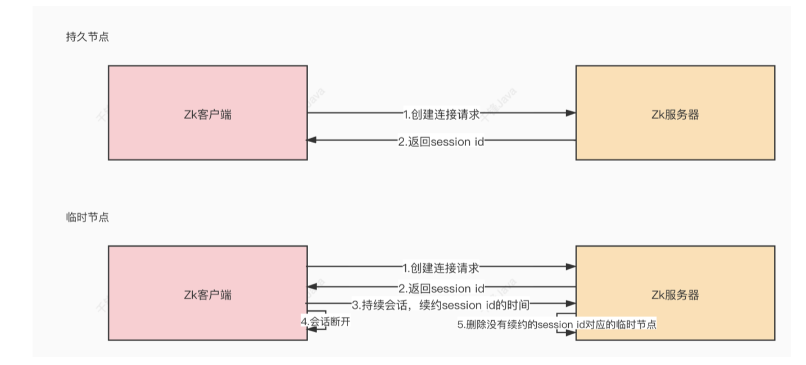

这样便会存在四种类型的目录节点，分别对应如下：

- PERSISTENT：永久节点
- EPHEMERAL：临时节点
- PERSISTENT_SEQUENTIAL：序列化永久节点
- EPHEMERAL_SEQUENTIAL：序列化临时节点


Container节点（3.5.3版本新增）：Container容器节点，当容器中没有任何⼦节点，该 容器节点会被zk定期删除（60s）。

 TTL节点：可以指定节点的到期时间，到期后被zk定时删除。只能通过系统配置 zookeeper.extendedTypesEnabled=true 开启


### zk的数据持久化

zk的数据是运⾏在内存中，zk提供了两种持久化机制：

- **事务⽇志** 

zk把执⾏的命令以⽇志形式保存在dataLogDir指定的路径中的⽂件中（如果没有指定 dataLogDir，则按dataDir指定的路径）。

- **数据快照**

zk会在⼀定的时间间隔内做⼀次内存数据的快照，把该时刻的内存数据保存在快照⽂件 中。

zk通过两种形式的持久化，在恢复时先恢复快照⽂件中的数据到内存中，再⽤⽇志⽂件中的数据做增量恢复，这样的恢复速度更快。


### Znode的属性

Zookeeper节点属性

| **属性名称**   | **属性描述**                                                 |
| -------------- | ------------------------------------------------------------ |
| czxid          | 节点被创建的Zxid值                                           |
| ctime          | 节点被创建的时间                                             |
| mzxid          | 节点最后一次的修改的Zxid值                                   |
| mtime          | 节点最后一次的修改时间                                       |
| pZxid          | 与该节点的子节点最后一次修改的Zxid值                         |
| cversion       | 子节点被修改的版本号                                         |
| dataVersion    | 数据版本号                                                   |
| aclVersion     | ACL版本号                                                    |
| ephemeralOwner | 如果此节点为临时节点，那么该值代表这个节点拥有者的会话ID；否则值为0 |
| dataLength     | 节点数据域长度                                               |
| numChildren    | 节点拥有的子节点个数                                         |

对于Zookeeper来说，Znode状态改变的每一个操作都将使节点接收到唯一的**事务id zxid（Zookeeper Transaction ID）**格式的时间戳，并且这个时间戳是全局有序的，通常被称为事物ID，通过zxid，可以确定更新操作的先后顺序


## Zookeeper的Watch机制

ZooKeeper提供了分布式数据发布/订阅功能，一个典型的发布/订阅模型系统定义了一种一对多的订阅关系，能让多个订阅者同时监听某一个主题对象，当这个主题对象自身状态变化时，会通知所有订阅者，使他们能够做出相应的处理。

在ZooKeeper中，引入了**Watch机制**来实现这种分布式的通知功能。ZooKeeper允许客户端向服务端注册一个Watch监听，当服务端的一些事件触发了这个Watch，那么就会向指定客户端发送一个事件通知，来实现分布式的通知功能。

### Watch机制的特点

**一次性触发**

当Watch的对象发生改变时，将会触发此对象上Watch所对应的事件，这种监听是一次性的，后续再次发生同样的事件，也不会再次触发。

**事件封装**

Zookeeper使用**WatchedEvent对象**来封装服务端事件并传递。该对象包含了每个事件的三个基本属性，即通知状态（keeperState）、事件类型（EventType）和节点路径（path）。

**异步发送**

Watch的通知事件是从服务端异步发送到客户端的。

**先注册再触发**

Zookeeper中的Watch机制，必须由客户端先去服务端注册监听，这样才会触发事件的监听，并通知给客户端。


### Watch机制的通知状态和事件类型

| **连接状态**  | **状态含义** | **事件类型**         | **事件含义**   |
| ------------- | ------------ | -------------------- | -------------- |
| Disconnected  | 连接失败     | NodeCreated          | 节点被创建     |
| SyncConnected | 连接成功     | NodeDataChanged      | 节点数据变更   |
| AuthFailed    | 认证失败     | NodeChildrentChanged | 子节点数据变更 |
| Expired       | 会话过期     | NodeDeleted          | 节点被删除     |

当客户端断开连接，这时客户端和服务器的连接就是**Disconnected**状态，说明连接失败；

当客户端和服务器的某一个节点建立连接，并完成一次version、zxid的同步，这时客户端和服务器的连接状态就是**SyncConnected**，说明连接成功；

当Zookeeper客户端连接认证失败，这时客户端和服务器的连接状态就是**AuthFailed**，说明认证失败；

当客户端发送Request请求，通知服务器其上一个发送心跳的时间，服务器收到这个请求后，通知客户端下一个发送心跳的时间是哪个时间点。当客户端时间戳达到最后一个发送心跳的时间，而没有收到服务器发来的新发送心跳的时间，即认为自己下线，这时客户端和服务器的连接状态就是**Expired**状态，说明会话过期。

当节点被创建时，**NodeCreated**事件被触发；

当节点的数据发生变更时，**NodeDataChanged**事件被触发；

当节点的**直接子节点**被创建、被删除、子节点数据发生变更时，**NodeChildrentChanged**事件被触发；

当节点被删除时，**NodeDeleted**事件被触发。


### 监听原理

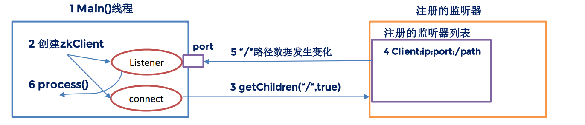

图解

1. 首先要有一个main()线程  
2. 在main线程中创建Zookeeper客户端， 这时就会创建两个线程， 一个负责网络连接通信(connet),一个负责监听(listener)。
3. 通过connect线程将注册的监听事件发送给Zookeeper。  
4. 在Zookeeper的注册监听器列表中将注册的监听事件添加到列表中。  
5. Zookeeper监听到有数据或路径变化， 就会将这个消息发送给listener线程。
6. listener线程内部调用了process（） 方法。

## Zookeeper ACL

Zookeeper类似于unix文件系统，节点类比文件，客户端可以删除节点，创建节点，修改节点。Zookeeper可以使用**ACL（access control list）**访问控制列表来对节点的权限进行控制。


使用scheme、id、permission 来标识，主要涵盖 3 个方面：

**权限模式（scheme）：授权的策略**

**授权对象（id）：授权的对象**

**权限（permission）：授予的权限**


### Zookeeper ACL的特性：

Zookeeper的权限控制是基于znode节点的，需要对每个节点设置权限。

每个znode支持设置多种权限控制方案和多个权限。

子节点不会继承父节点的权限。客户端无法访问某个节点，但是可以访问他的子节点


值得注意的是，exists操作和getAcl操作并不受ACL许可控制，因此任何客户端可以查询节点的状态和节点的ACL。

### **关于授权的命令**

| 命令    | 用法                 | 描述                         |
| ------- | -------------------- | ---------------------------- |
| getAcl  | getAcl path          | 读取节点的ACL                |
| setAcl  | setAcl path acl      | 设置节点的ACL                |
| create  | create path data acl | 创建节点时设置acl            |
| addAuth | addAuth scheme auth  | 添加认证用户，类似于登录操作 |

**权限模式种类**

| 模式   | 描述                                                         |
| ------ | ------------------------------------------------------------ |
| world  | 这种模式方法的授权对象只有一个anyone，代表登录到服务器的所有客户端都能对该节点执行某种权限 |
| ip     | 对连接的客户端使用IP地址认证方式进行认证                     |
| auth   | 使用以添加认证的用户进行认证                                 |
| digest | 使用 用户:密码方式验证                                       |
| super  | 在这种scheme情况下，对应的id拥有超级权限，可以做任何事情(cdrwa） |

**权限的类型**

| 类型   | ACL简写 | 描述                           |
| ------ | ------- | ------------------------------ |
| read   | r       | 读取节点及显示子节点列表的权限 |
| write  | w       | 设置节点数据的权限             |
| create | c       | 创建子节点的权限               |
| delete | d       | 删除子节点的权限               |
| admin  | a       | 设置该节点ACL权限的权限        |

 Znode ACL权限可以用一个int型数字perms表示，perms的5个二进制位分别表示setacl、delete、create、write、read。比如0x1f=adcwr，0x1=----r，0x15=a-c-r。

 ``` shell
 一个简单使用setAcl命令，则可以为：
   
   setAcl /zookeeper/node1 world:anyone:cdrw
 ```


**world权限模式**

只有一种设置模式。就是 setAcl world:anyone:[r] [w] [c] [d] [a]

```cobol
setAcl /node1 world:anyone:cdwa     取消节点读取数据权限

getAcl /node1                     查看节点权限

get /node1                        获取node1节点值
```


**IP权限模式**

该模式使用的ACL方式是 ip:10.30.196.4:[r] [w] [c] [d] [a]

```cobol
create /node20 "node20"

setAcl /node20 ip:10.30.196.4:rwcda

getAcl /node20

get /node20
```


**auth授权模式**

这个要配合addauth命令。

第一步：先添加授权用户 addauth digest username:password

第二步：设置该节点只有登录了该授权用户的客户端连接才能进行操作。

```cobol
addauth digest admin:123456

create /nodeAuth “nodeAuth”

setAcl /nodeAuth auth:admin:rwdca

getAcl /nodeAuth
```

把客户端quit退出重新连接后：

失去了对该节点的权限。需要使用addauth命令添加授权才行。类似登录之后才能对该节点有权限。

``` shell
addauth digest admin：123456

get /nodeAuth
```


**digest授权模式**

基于账号密码的授权模式，与Auth模式类似，只是他设置权限之前不用使用addauth digest username:password进行权限用户添加。直接使用命令 setAcl path digest:username:password:acl 进行授权就行(只是这里的密码要使用加密后的密码，不能使用铭文密码)。

linux命令行输入

```cobol
echo -n admin:123456 | openssl dgst -binary -sha1 | openssl base64
```

zkCli客户端输入

```cobol
create /nodeDigest "nodeDigest"

setAcl /nodeDigest digest:admin:0uek/hZ/V9fgiM35b0Z2226acMQ=:rwdca

getAcl /nodeDigest

get /nodeDigest

addauth digest admin:123456

getAcl /nodeDigest

get /nodeDigest
```


## Zookeeper的一致性

Zookeeper写入是强一致性,读取是顺序一致性。

几种一致性的概念
**强一致性:又称线性一致性(linearizability ),**

- 1.任意时刻，所有节点中的数据是一样的,
- 2.一个集群需要对外部提供强一致性，所以只要集群内部某一台服务器的数据发生了改变，那么就需要等待集群内其他服务器的数据同步完成后，才能正常的对外提供服务
- 3.保证了强一致性，务必会损耗可用性

**弱一致性:**

- 1.系统中的某个数据被更新后，后续对该数据的读取操作可能得到更新后的值，也可能是更改前的值。
- 2.即使过了不一致时间窗口，后续的读取也不一定能保证一致。

**最终一致性:**

- 1.弱一致性的特殊形式,不保证在任意时刻任意节点上的同一份数据都是相同的，但是随着时间的迁移，不同节点上的同一份数据总是在向趋同的方向变化
- 2.存储系统保证在没有新的更新的条件下，最终所有的访问都是最后更新的值

**顺序一致性:**

- 1.任何一次读都能读到某个数据的最近一次写的数据。
- 2.系统的所有进程的顺序一致，而且是合理的。即不需要和全局时钟下的顺序一致，错的话一起错，对的话一起对(目前网上能查到的原话)

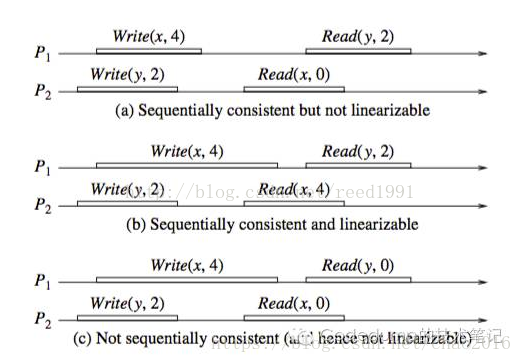

图a是满足顺序一致性，但是不满足强一致性的。原因在于，从全局时钟的观点来看，P2进程对变量X的读操作在P1进程对变量X的写操作之后，然而读出来的却是旧的数据。但是这个图却是满足顺序一致性的，因为两个进程P1，P2的一致性并没有冲突。从这两个进程的角度来看，顺序应该是这样的：Write(y,2) , Read(x,0) , Write(x,4), Read(y,2)，每个进程内部的读写顺序都是合理的，但是这个顺序与全局时钟下看到的顺序并不一样。
2）图b满足强一致性，因为每个读操作都读到了该变量的最新写的结果，同时两个进程看到的操作顺序与全局时钟的顺序一样，都是Write(y,2) , Read(x,4) , Write(x,4), Read(y,2)。
3）图c不满足顺序一致性，当然也就不满足强一致性了。因为从进程P1的角度看，它对变量Y的读操作返回了结果0。那么就是说，P1进程的对变量Y的读操作在P2进程对变量Y的写操作之前，这意味着它认为的顺序是这样的：write(x,4) , Read(y,0) , Write(y,2), Read(x,0)，显然这个顺序又是不能被满足的，因为最后一个对变量x的读操作读出来也是旧的数据。因此这个顺序是有冲突的，不满足顺序一致性。


**在zookeeper中，一般的读，都是直接读本机node的记录，是什么就返回什么，由于过半写机制，有可能读到stale data，一般用sync方法同步一下。**

## ZAB协议

Zookeeper使用⼀种称为Zookeeper Atomic Broadcast（ZAB，Zookeeper原⼦消息⼴播协议）的协议作为其数据⼀致性的核⼼算法。ZAB协议并不像Paxos算法那样是⼀种通⽤的分布式⼀致性算法，ZAB协议是⼀种特别为Zookeeper专⻔设计的⼀种⽀持崩溃恢复的原⼦⼴播协议。

ZAB协议的核⼼是定义了对于那些会改变Zookeeper服务器数据状态的事务请求的处理⽅式。即：所有事务请求必须由⼀个全局唯⼀的服务器来协调处理，这样的服务器被称为Leader服务器，余下的服务器则称为Follower服务器

ZooKeeper集群中节点的角色: **Leader ; Follower ; Observer**

- Leader

  ```
  Zookeeper 集群工作的核心。
  
  事务请求（写操作）的唯一调度和处理者，保证集群事务处理的顺序性；集群内部各个服务器的调度者。
  对于 create， setData， delete 等有写操作的请求，需要统一转发给leader 处理， leader 需要决定编号、执行操作，这个过程称为一个事务。
  ```

  

- Follower

  ```
  - 处理客户端非事务（读操作）请求，转发事务请求给 Leader；
  - 参与集群 Leader 选举投票 2n-1台可以做集群投票。
  - 此外，针对访问量比较大的 zookeeper 集群， 还可新增观察者角色。
  ```

  

- Observer

  ```
  - 观察者角色，观察 Zookeeper 集群的最新状态变化并将这些状态同步过来，其对于非事务请求可以进行独立处理，对于事务请求，则会转发给 Leader服务器进行处理。
  - 不会参与任何形式的投票只提供非事务服务，通常用于在不影响集群事务处理能力的前提下提升集群的非事务处理能力。
  ```


ZAB协议包括两种基本的模式： **崩溃恢复和消息⼴播。**

**进⼊崩溃恢复模式：**
当整个服务框架启动过程中，或者是Leader服务器出现⽹络中断、崩溃退出或重启等异常情况时， ZAB协议就会进⼊崩溃恢复模式，同时选举产⽣新的Leader服务器。当选举产⽣了新的Leader服务器，同时集群中已经有过半的机器与该Leader服务器完成了状态同步之后， ZAB协议就会退出恢复模式，其中，所谓的状态同步 就是指数据同步，⽤来保证集群中过半的机器能够和Leader服务器的数据状态保持⼀致

为保持数据一致性**Zab 协议崩溃恢复需满足以下2个请求：**

- 确保已经被 Leader  commit的 proposal 必须最终被所有的 Follower 服务器提交
- 确保丢弃已经被 Leader 提出的但没有被提交的 Proposal

针对情况一，当leader宕机以后，ZooKeeper会选举出来新的leader，新的leader启动以后要到磁盘上面去检查是否存在没有commit的消息，如果存在，就继续检查看其他follower有没有对这条消息进行了commit，如果有过半节点对这条消息进行了ack，但是没有commit，那么新对leader要完成commit的操作。

针对情况二，客户端把消息写到leader了，但是leader还没发送portal消息给其他节点，这个时候leader宕机了，这个时候对于用户来说，这条消息是写失败的。假设过了一段时间以后leader节点又恢复了，不过这个时候角色就变为了follower了，它在检查自己磁盘的时候会发现自己有一条消息没有进行commit，此时就会检测消息的编号，消息是有编号的，由高32位和低32位组成，高32位是用来体现是否发生过leader切换的，低32位就是展示消息的顺序的。这个时候当前的节点就会根据高32位知道目前leader已经切换过了，所以就把当前的消息删除，然后从新的leader同步数据，这样保证了数据一致性。


**进⼊消息⼴播模式：**
当集群中已经有过半的Follower服务器完成了和Leader服务器的状态同步，那么整个服务框架就可以进⼊消息⼴播模式， 当⼀台同样遵守ZAB协议的服务器启动后加⼊到集群中，如果此时集群中已经存在⼀个Leader服务器在负责进⾏消息⼴播，那么加⼊的服务器就会⾃觉地进⼊数据恢复模式：找到Leader所在的服务器，并与其进⾏数据同步，然后⼀起参与到消息⼴播流程中去。 

Zookeeper只允许唯⼀的⼀个Leader服务器来进⾏事务请求的处理， Leader服务器在接收到客户端的事务请求后，会⽣成对应的事务提议并发起⼀轮⼴播协议，⽽如果集群中的其他机器收到客户端的事务请求后，那么这些⾮Leader服务器会⾸先将这个事务请求转发给Leader服务器。

 Leader服务器负责将⼀个客户端事务请求转化成⼀个事务Proposal（提议），并将该Proposal分发给集群中所有的Follower服务器，之后Leader服务器需要等待所有Follower服务器的反馈，**⼀旦超过半数的Follower服务器**进⾏了正确的反馈后，那么Leader就会再次向所有的Follower服务器分发Commit消息，要求其将前⼀个Proposal进⾏提交。

过半写机制 目的是得到高可用性，允许尽量多的节点失败但又不影响算法的正确性。

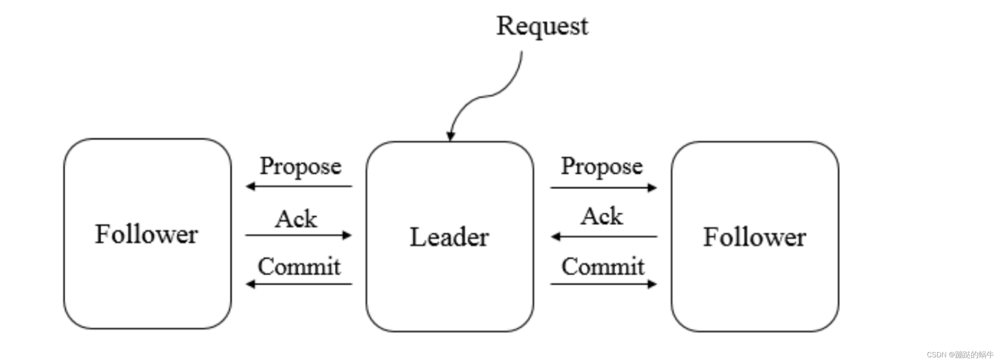

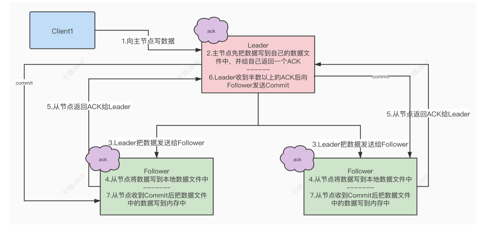

Q：为什么是一半？

A：我们把半数以上定义为majority，中文名多数派。任意两个多数派一定会有交集，任何两个多数派必然有交集，在Leader切换（Leader down）时，这些交集依然保持着最新的系统状态。


## Zookeeper的选举机制


### 选举机制

Zookeeper为了保证各节点的协同工作，在工作时需要一个Leader角色，而Zookeeper默认采用FastLeaderElection算法，且投票数大于半数则胜出的机制


**投票相关**

**服务器ID** （myid）

这是在配置集群时设置的**myid**参数文件，且参数分别表示为服务器1、服务器2、服务器3，编号越大在FastLeaderElection算法中的权重越大。

**事务ID** （zxid）

是服务器中存放的最新数据版本号，该值越大则说明数据越新，在选举过程中数据越新权重越大。

**逻辑时钟**（Epoch）

通俗的讲，逻辑时钟被称为投票次数，同一轮投票过程中的逻辑时钟值是相同的，逻辑时钟起始值为0，每投完一次票，这个数据就会增加。然后，与接收到其它服务器返回的投票信息中的数值相比较，根据不同的值做出不同的判断。如果某台机器宕机，那么这台机器不会参与投票，因此逻辑时钟也会比其他的低。

在进行选举的时候，epoch > zxid > myid


**选举状态**

在选举过程中，Zookeeper服务器有四种状态，它们分别为**竞选状态（LOOKING）、随从状态（FOLLOWING，同步leader状态，参与投票）、观察状态（OBSERVING，同步leader状态，不参与投票）、领导者状态（LEADING）。**


### 选举机制的类型

Zookeeper选举机制有两种类型，分别为全新集群选举和非全新集群选举，下面分别对两种类型进行详细讲解。

**1.全新集群选举**

全新集群选举是新搭建起来的，没有数据ID和逻辑时钟的数据影响集群的选举。假设，目前有5台服务器，它们的编号分别是1-5，按编号依次启动Zookeeper服务。下面来讲解全新集群选举的过程。

步骤1：服务器1启动，首先，会给自己投票；其次，发投票信息，由于其它机器还没有启动所以它无法接收到投票的反馈信息，因此服务器1的状态一直属于LOOKING状态。

步骤2：服务器2启动，首先，会给自己投票；其次，在集群中启动Zookeeper服务的机器发起投票对比，这时它会与服务器1交换结果，由于服务器2的编号大，所以服务器2胜出，此时服务器1会将票投给服务器2，但此时服务器2的投票数并没有大于集群半数（2<5/2），所以两个服务器的状态依然是LOOKING状态。

步骤3：服务器3启动，首先会给自己投票；其次，与之前启动的服务器1、2交换信息，由于服务器3的编号最大所以服务器3胜出，那么服务器1、2会将票投给服务器3，此时投票数正好大于半数（3>5/2），所以服务器3成为领导者状态，服务器1、2成为追随者状态。

步骤4：服务器4启动，首先，给自己投票；其次，与之前启动的服务器1、2、3交换信息，尽管服务器4的编号大，但是服务器3已经胜出。所以服务器4只能成为追随者状态。

步骤5：服务器5启动，同服务器4一样，均成为追随者状态。

**2.非全新集群选举**

对于正常运行的Zookeeper集群，一旦中途有服务器宕机，则需要重新选举时，选举的过程中就需要引入服务器ID、数据ID和逻辑时钟。这是由于Zookeeper集群已经运行过一段时间，那么服务器中就会存在运行的数据。下面来讲解非全新集群选举的过程。

步骤1：首先，统计逻辑时钟是否相同，逻辑时钟小，则说明途中可能存在宕机问题，因此数据不完整，那么该选举结果被忽略，重新投票选举；

步骤2：其次，统一逻辑时钟后，对比数据ID值，数据ID反应数据的新旧程度，因此数据ID大的胜出；

步骤3：如果逻辑时钟和数据ID都相同的情况下，那么比较服务器ID（编号），值大则胜出；

简单的讲，非全新集群选举时是优中选优，保证Leader是Zookeeper集群中数据最完整、最可靠的一台服务器。

选举完成后地处理

1. 其它服务器(Learner)向Leader发起TCP连接请求，Leader为每一个建立了连接地服务端创建一个LearnerHandler，该handle对应Leader和一个服务器地连接，由它负责完成两者之间地消息通信和数据同步；
2. 建立起连接后，Learner向Leader发起注册，即将自己的信息发送给Leader。Leader更新完epoch后，会将自己的信息发送给Learner，然后Learner收到后回送一个Ack消息；
3. Leader收到Ack消息后，会开始与其进行**数据同步**，**当Leader与半数以上的服务端完成数据同步后，集群就可以对外提供服务了**；

数据同步

ZK服务端维护一个**最近提交的事务**的队列committedLog，Leader主要通过committedLog中最小的ZXID即**minCommittedLog**、committedLog中最大的ZXID即**maxCommittedLog**、Learner服务器最后处理的事务的ZXID即**peerLastZxid**这3个元素来完成与Learner的数据同步，具体来说有以下4中方式：

1. peerLastZxid介于minCommittedLog和maxCommittedLog之间，使用直接**差异化同步**(DIFF同步)。Leader首先向这个Learner发送一个DIFF指令，通知Learner进入差异化数据同步阶段，然后将peerLastZxid到maxCommittedLog之间的事务发送给Learn，针对每个Proposal，Leader都会通过发送PROPOSAL内容数据包和COMMIT指令数据包来完成；
2. 在情况1的基础上，Leader发现Learner包含一条自己没有的事务记录（例如该Learn之前是Leader产生了一个Proposal但是并没有广播给其它服务器就挂了，然后现在又恢复了的场景），使用**先回滚再差异化同步**(TRUNC+DIFF同步)，先让该Learner进行事务回滚，回滚到Leader服务器上存在的，同时也是最接近于peerLastZxid的ZXID，然后再使用差异化同步；
3. peerLastZxid大于maxCommittedLog，使用仅**回滚同步**(TRUNC同步)，Leader要求Learner回滚到ZXID值为maxCommittedLog对应的事务操作；
4. peerLastZxid小于minCommittedLog或Leader服务器上没有committedLog队列，使用全量同步(SNAP同步)，Leader首先向Learner发送一个SNAP指令，通知Learner即将进行全量同步，然后Leader会从内存数据库中获取到全量的数据节点，将他们序列化后传输给Learner，Learner接收到该全量数据后，对其反序列化后载入到内存数据库中；


## 分布式锁

### 分布式锁的介绍

在Java的多线程部分，我们知道如果在一个jvm进程中，多个线程之间同时访问一个资源，此时会有多线程的安全问题。为了解决这个线程安全的问题，我们可以使用“锁”来实现。但是，多个jvm进程之间如果同时访问一个资源呢？此时在Java部分学习到的“锁”已经不能解决这个问题了，我们就需要“分布式锁”来实现这样的效果了。

> 维基百科对分布式锁的定义:
>
> **分布式锁**，是控制分布式系统之间同步访问共享资源的一种方式。在分布式系统中，常常需要协调他们的动作。如果不同的系统或是同一个系统的不同主机之间共享了一个或一组资源，那么访问这些资源的时候，往往需要互斥来防止彼此干扰来保证一致性，在这种情况下，便需要使用到分布式锁。

### 分布式锁的分类

在不同的业务场景下，分布式锁也有不同的使用方式，常见的分类有两种: **阻塞锁** 和 **非阻塞锁**。

**阻塞锁:** 

当有多个jvm进程同时访问一个共享的资源的时候，已经抢到分布式锁的jvm进程执行自己的业务逻辑，没有抢到分布式锁的jvm进程进入阻塞状态等待。获取到分布式锁的jvm进程在处理完自己的业务逻辑之后，会将锁进行释放。


**非阻塞锁:**

当有多个jvm进程同时访问一个共享的资源的时候，已经抢到分布式锁的jvm进程执行自己的业务逻辑，没有抢到分布式锁的jvm进程不会等待，直接结束，不执行任何的业务逻辑。


### 分布式锁的原理

使用ZooKeeper实现分布式锁，其实就是在Zookeeper上进行节点的创建。多个程序同时需要操作一个共享的资源时，可以先在ZooKeeper进行节点的注册，注册成功的表示抢到了锁，注册失败的表示没有获取到锁。

##### 使用节点实现

所有的程序向ZooKeeper中注册同一个指定名字的节点，首先将节点创建成功的程序持有锁，可以操作共享资源。后来的程序在进行节点创建的时候，发现锁已经存在了，于是无法重复注册。

##### 使用子节点实现

所有的程序向ZooKeeper中的指定节点下注册子节点（需要使用短暂、有序节点），以节点的序号为优先级，序号小的更早注册，序号大的晚注册。于是，序号小的节点获取到锁，其他的程序依次向前监听节点。

举例

``` shell
以/root节点，5个程序为例:

A程序注册节点/root/child0001
	此时子节点: { child0001 }
	自己就是序号最小的节点，可以获取锁，执行自己的逻辑操作
	
B程序注册节点/root/child0002
	此时的子节点: { child0001, child0002 }
	B发现自己不是最小的节点，说明有人捷足先登了，于是监听自己前面的child0001节点
	
C程序注册节点/root/child0003
	此时的子节点: { child0001, child0002, child0003 }
	C发现自己不是最小的节点，说明有人捷足先登了，于是监听自己前面的child0002节点
	
此时A程序执行结束了，由于是短暂类型的节点，因此child0001节点会被删除
	此时的子节点: { child0002, child0003 }
	B程序由于监听了child0001，因此可以得知这个节点已经被删除了，被唤醒之后发现自己就是最小的节点，获取到锁，执行逻辑
	
D程序注册节点/root/child0004
	此时的子节点: { child0002, child0003, child0004 }
	D发现自己不是最小的节点，说明有人捷足先登了，于是监听自己前面的child0003节点
以此类推
```

### 分布式锁的实现

##### 父类的设计

设计父类，提供连接ZooKeeper服务端的逻辑、节点操作的逻辑，所有的方式实现的锁都继承自这个类。

``` java
package com.qianfeng.lock;

import org.apache.zookeeper.*;
import org.apache.zookeeper.data.Stat;

import java.io.IOException;
import java.util.concurrent.CountDownLatch;


public abstract class ZkLockerBase implements Watcher {

    /**
     * 操作的锁名称
     */
    protected String lockName;

    /**
     * ZooKeeper连接客户端
     */
    private ZooKeeper zkCli = null;

    /**
     * 确保可以连接到ZooKeeper客户端
     */
    private final CountDownLatch latch = new CountDownLatch(1);

    /**
     * 锁的根节点名称
     */
    protected String rootNodeName = "/zk-lock";


    /**
     * 连接到预设的服务器
     */
    public ZkLockerBase() {
        this("qianfeng01:2181,qianfeng02:2181,qianfeng03:2181");
    }

    /**
     * 连接到ZooKeeper的指定服务端
     * @param connectString 连接字符串
     */
    public ZkLockerBase(String connectString) {
        try {
            // 连接到ZooKeeper服务端
            this.zkCli = new ZooKeeper(connectString, 5000, this);
            // 等待连接成功的信号
            this.latch.await();
            // 创建根节点
            createRootNode();
        } catch (IOException | InterruptedException e) {
            e.printStackTrace();
        }
    }

    public ZkLockerBase(String connectString, String lockName) {
        this(connectString);
        this.lockName = lockName;
    }

    /**
     * 创建节点
     * @param nodeName 创建的节点名称
     * @param createMode 创建模式
     * @return 创建成功的节点名称，如果创建失败，返回null
     */
    public String createNode(String nodeName, CreateMode createMode) {
        try {
            // 创建节点，并返回创建成功之后的节点名称
            return this.zkCli.create(nodeName, "".getBytes(), ZooDefs.Ids.OPEN_ACL_UNSAFE, createMode);
        } catch (KeeperException | InterruptedException ignored) {

        }
        return null;
    }

    /**
     * 删除节点
     * @param nodeName 删除的节点名称
     * @return 删除的结果
     */
    public boolean deleteNode(String nodeName) {
        try {
            // 删除节点
            this.zkCli.delete(nodeName, -1);
            return true;
        } catch (InterruptedException | KeeperException ignored) {
        }
        return false;
    }

    /**
     * 判断节点是否存在
     * @param nodeName 节点的名字
     * @return 是否存在
     */
    public boolean exists(String nodeName) {
        try {
            Stat exists = zkCli.exists(nodeName, false);
            return exists != null;
        } catch (KeeperException | InterruptedException e) {
            e.printStackTrace();
        }
        return false;
    }


    /**
     * 创建根节点，存放所有的节点或者子节点实现的锁
     */
    public void createRootNode() {
        if (!exists(this.rootNodeName)) {
            createNode(this.rootNodeName, CreateMode.CONTAINER);
        }
    }

    public String getLockName() {
        return this.rootNodeName + "/" + lockName;
    }


    public ZooKeeper getZkCli() {
        return zkCli;
    }

    @Override
    public void process(WatchedEvent event) {
        switch (event.getType()) {
            case None:
                if (event.getState().equals(Event.KeeperState.SyncConnected)) {
                    // 说明连接到服务端成功
                    this.latch.countDown();
                }
            case NodeCreated:
                processCreatedNode(event);
                break;
            case NodeDeleted:
                processDeleteNode(event);
                break;
            case NodeChildrenChanged:
                processChildernChange(event);
                break;
        }
    }

    // 创建节点回调
    protected void processCreatedNode(WatchedEvent event) {}
    // 删除节点回调
    protected void processDeleteNode(WatchedEvent event) {}
    // 子节点变更回调
    protected void processChildernChange(WatchedEvent event) {}
}

```

##### 锁接口的设计

提供所有的锁必须要实现的功能，制定锁的规范。

``` java
package com.qianfeng.lock;

public interface ZkLocker {

    /**
     * 上锁
     */
    boolean lock();

    /**
     * 解锁
     */
    boolean unlock();

    /**
     * 判断锁是否存在
     * @return 是否存在
     */
    boolean exists();
}

```

##### 节点实现的非阻塞型锁

``` java
package com.qianfeng.lock.nodeLock;

import com.qianfeng.lock.ZkLocker;
import com.qianfeng.lock.ZkLockerBase;
import org.apache.zookeeper.CreateMode;

public class ZkLockerNodeNoneBlockingLocker extends ZkLockerBase implements ZkLocker {

    public ZkLockerNodeNoneBlockingLocker(String connectString, String lockName) {
        super(connectString, lockName);
    }

    public ZkLockerNodeNoneBlockingLocker(String lockName) {
        super();
        this.lockName = lockName;
    }

    /**
     * 上锁
     */
    @Override
    public boolean lock() {
        // 1. 拼接完整的节点路径
        String lockNode = this.rootNodeName + "/" + lockName;
        // 2. 创建锁
        return createNode(lockNode, CreateMode.EPHEMERAL) != null;
    }

    /**
     * 解锁
     */
    @Override
    public boolean unlock() {
        // 1. 拼接完整的节点路径
        String lockNode = this.rootNodeName + "/" + lockName;
        // 2. 删除锁
        return deleteNode(lockNode);
    }

    /**
     * 判断锁是否存在
     *
     * @return 是否存在
     */
    @Override
    public boolean exists() {
        // 1. 拼接完整的节点路径
        String lockNode = this.rootNodeName + "/" + lockName;
        // 2. 判断是否存在
        return super.exists(lockNode);
    }
}

```

##### 子节点实现的锁

在生产环境中，使用子节点做分布式锁的实现的场景是最常见的，包括阻塞型的锁和非阻塞型的锁。因此，设计子节点实现的锁的父类，提供公共的处理逻辑。将阻塞型和非阻塞型的实现不同的逻辑分别在子类中实现即可。

``` java
package com.qianfeng.lock.childNodeLock;

import com.qianfeng.lock.ZkLocker;
import com.qianfeng.lock.ZkLockerBase;
import org.apache.zookeeper.CreateMode;
import org.apache.zookeeper.KeeperException;

import java.util.Collections;
import java.util.List;


public abstract class ZkChildNodeLockerBase extends ZkLockerBase implements ZkLocker {

    /**
     * 创建的子节点锁的全路径
     */
    protected String nodeFullPath;

    public ZkChildNodeLockerBase(String connectString, String lockName) {
        super(connectString, lockName);
        createLockNode();
    }

    public ZkChildNodeLockerBase(String lockName) {
        super();
        this.lockName = lockName;
        createLockNode();
    }

    // 创建锁节点
    public void createLockNode() {
        // 1. 判断节点是否存在
        if (!exists(getLockName())) {
            // 3. 创建锁节点
            createNode(getLockName(), CreateMode.CONTAINER);
        }
    }

    @Override
    public boolean lock() {
        // 1. 在锁节点下创建子节点
        this.nodeFullPath = createNode(getLockName() + "/child-", CreateMode.EPHEMERAL_SEQUENTIAL);
        // 2. 判断是否可以成功上锁
        return canLock();
    }

    @Override
    public boolean unlock() {
        return deleteNode(this.nodeFullPath);
    }

    @Override
    public boolean exists() {
        // 获取当前锁节点下的子节点数量，如果大于0，说明有锁存在
        try {
            List<String> children = getZkCli().getChildren(getLockName(), false);
            return children.size() > 0;
        } catch (KeeperException | InterruptedException ignored) {
        }
        return false;
    }

    protected abstract boolean canLock();


    /**
     * 获取当前创建的子节点之前的节点（根据序号）
     * @return 之前的节点
     */
    protected String getPreviousNode() {
        // 定义变量，记录上一个节点名称
        String previousNodeName = null;
        try {
            // 1. 获取锁节点下所有的子节点
            List<String> children = getZkCli().getChildren(getLockName(), false);
            // 2. 对所有的节点进行名字排序
            Collections.sort(children);
            // 3. 获取当前创建的子节点名称
            String childNodeName = this.nodeFullPath.substring(getLockName().length() + 1);
            // 4. 遍历所有的节点，进行名称的比对
            for (String child : children) {
                if (child.equals(childNodeName)) {
                    break;
                }
                previousNodeName = child;
            }
        } catch (KeeperException | InterruptedException e) {
            e.printStackTrace();
        }
        return previousNodeName;
    }
}

```

##### 子节点实现的非阻塞型锁

``` java
package com.qianfeng.lock.childNodeLock;


public class ZkChildNodeNoneBlockingLocker extends ZkChildNodeLockerBase {
    public ZkChildNodeNoneBlockingLocker(String connectString, String lockName) {
        super(connectString, lockName);
    }

    public ZkChildNodeNoneBlockingLocker(String lockName) {
        super(lockName);
    }

    @Override
    protected boolean canLock() {
        // 1. 判断是否有之前的节点
        String previousNodeName = getPreviousNode();
        // 2. 如果不存在之前的节点，说明上锁成功
        if (previousNodeName == null) {
            return true;
        }
        // 3. 如果存在之前的节点，说明上锁失败，删除自己创建的子节点即可
        deleteNode(this.nodeFullPath);
        return false;
    }
}

```

##### 子节点实现的阻塞型锁

A程序在进行上锁的时候，发现已经被其他的程序获取到锁了，自己需要等待其他的程序释放锁。基本的实现逻辑就是自己监控已经创建好的节点，发现这个节点消失的时候，自己去创建节点。但是为什么没有用节点作为锁来实现阻塞型的锁呢？是因为这里有“羊群效应”。

假如有100个程序来获取锁，结果发现锁已经被其他的程序注册了，于是这100个程序都去监听这个节点。一旦这个节点被删除，这100个程序都可以获取到状态的变更，会同时请求ZooKeeper创建节点。这样会带来瞬时的资源占用剧增，严重的甚至可能导致服务器宕机。因此，我们在实现阻塞型锁的时候，使用的是有序的子节点来实现的，每一个程序监控比自己编号小的节点即可。

``` java
package com.qianfeng.lock.childNodeLock;

import org.apache.zookeeper.AddWatchMode;
import org.apache.zookeeper.KeeperException;

import java.util.concurrent.CountDownLatch;


public class ZkChildNodeBlockingLocker extends ZkChildNodeLockerBase {

    // 等待释放信号
    private CountDownLatch latch = new CountDownLatch(1);

    public ZkChildNodeBlockingLocker(String connectString, String lockName) {
        super(connectString, lockName);
    }

    public ZkChildNodeBlockingLocker(String lockName) {
        super(lockName);
    }

    @Override
    protected boolean canLock() {
        // 获取自己创建的子节点之前序号的节点
        String previousNode = getPreviousNode();
        // 如果之前节点不存在，说明已经上锁成功
        if (previousNode == null) {
            return true;
        }
        // 如果有比当前创建的节点序号更小的节点，说明上锁失败，自己阻塞，监听之前的节点即可
        try {
            getZkCli().addWatch(getLockName() + "/" + previousNode, event -> {
                if (event.getType().equals(Event.EventType.NodeDeleted)) {
                    // 说明之前节点被删除掉了
                    latch.countDown();
                }
            }, AddWatchMode.PERSISTENT);
            // 等待信号
            latch.await();
        } catch (KeeperException | InterruptedException e) {
            e.printStackTrace();
        }
        // 自己成为了最小的节点，上锁成功
        return true;
    }
}

```


------


## HA高可用集群

### HA介绍

什么是HA

​	**HA: High Availability**，高可用集群，指的是集群7*24小时不间断服务。

为什么需要HA

在HDFS中，有NameNode、DataNode和SecondaryNameNode角色的分布，客户端所有的操作都是要与NameNode交互的，同时整个集群的命名空间信息也都保存在NameNode节点。但是，现在的集群配置中只有一个NameNode，于是就有一个问题: **单点故障**

那么，什么是单点故障呢？现在集群中只有一个NameNode，那么假如这个NameNode意外宕机、升级硬件等，导致NameNode不可用了，整个集群是不是也就不可用了？这就是单点故障的问题。

为了解决这样的问题，就需要高可用集群了。

------

**高可用的备份方式**

主从模式（冷备）

准备两台服务器, 准备相同的程序。 一台服务器对外提供服务, 称为**主节点(Active节点)**; 另外一台服务器平时不对外提供服务, 主要负责和Active节点之间进行数据的同步, 称为**备份节点(Standby节点)**. 当主节点出现故障, Standby节点可以自动提升为Active节点, 对外提供服务。
**ZooKeeper实现的集群高可用, 采用的就是这种模式。**

双主互备（热备）

准备两台服务器, 准备相同的程序. 同时对外提供服务(此时, 这两台服务器彼此为对方的备份), 这样, 当一台节点宕机的时候, 另外一台节点还可以继续提供服务.

集群多备

基本上等同于双主互备, 区别就在于同时对外提供服务的节点数量更多, 备份数量更多

------


**ZooKeeper高可用的实现**

​	我们在这里采用的是主从模式的备份方式，也就是准备两个NameNode，一个对外提供服务，称为Active节点；另外一个不对外提供服务，只是实时的同步Active节点的数据，称为Standby的节点。

​	为了提供快速的故障转移，Standby节点还必须具有集群中块位置的最新信息。为了实现这一点，DataNodes被配置了两个NameNodes的位置，并向两者发送块位置信息和心跳信号。也就是说，DataNode同时向两个NameNode心跳反馈。


------


### 高可用架构图

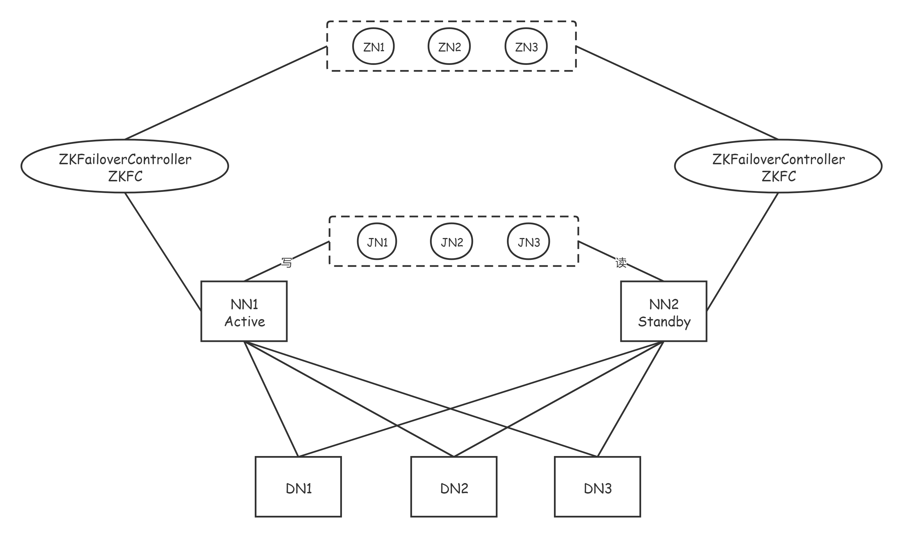

**JournalNode**

- **JournalNode的功能**

  ```
  Hadoop2.x版本之后, Clouera提出了QJM/QuromJournal Manager, 这是一个基于Paxos算法实现的HA的实现方案
  
  1. 基本的原理就是使用2N+1台JN存储EditLog, 每次写入数据的时候, 有半数以上的JN返回成功的信息, 就表示本次的操作已经同步到了JN
  
  2. 在HA中, SecondaryNameNode这个角色已经不存在了, 保证Standby节点的元数据信息与Active节点的元数据信息一致, 需要通过若干个JN
  
  3. 当有任何的操作发生在Active节点上的时候, JN会记录这些操作到半数以上的节点中. Standby节点检测JN中的log日志文件发生了变化, 会读取JN中的数据到自己的内存中, 维护最新的目录树结构与元数据信息
  
  4. 当发生故障的时候, Active节点挂掉, 此时Standby节点在成为新的Active节点之前, 会将读取到的EditLog文件在自己的内存中进行推演, 得到最新的目录树结构. 此时再升为Active节点, 可以无缝的继续对外提供服务.
  ```


- **防止脑裂的发生**

  ```
  	对于HA群集的正确操作至关重要，一次只能有一个NameNode处于Active状态。否则，名称空间状态将在两者之间迅速分散，从而有数据丢失或其他不正确结果的风险。为了确保该属性并防止所谓的“裂脑情况”，JournalNode将一次仅允许单个NameNode成为作者。在故障转移期间，变为活动状态的NameNode将仅承担写入JournalNodes的角色，这将有效地防止另一个NameNode继续处于活动状态，从而使新的Active可以安全地进行故障转移。
  	
  - 怎么理解脑裂？
  	就是Active节点处于网络震荡状态，假死状态，Standby就转为Active。等网络震荡过后，就有两个Active了，这就是脑裂。
  ```

  

- **JournalNode集群正常工作的条件**

  ```
  - 至少3个Journalnode节点
  - 运行个数建议奇数个(3,5,7等)
  - 满足（n+1）/2个以上，才能正常服务。即能容忍（n-1）/2个故障。
  ```

  

- **JournalNode的缺点**

  ```
  	在这种模式下，即使活动节点发生故障，系统也不会自动触发从活动NameNode到备用NameNode的故障转移，必须需要人为的操作才行。要是有一个能监视Active节点的服务功能就好了。
  	这个时候，我们就可以使用zookeeper集群服务，来帮助我们进行自动容灾了。
  ```

### 自动容灾原理

​	如果想进行HA的自动故障转移，那么需要为HDFS部署两个新组件：ZooKeeper quorum和ZKFailoverController进程（缩写为ZKFC）

#### **Zookeeper quorum**

​	Apache ZooKeeper是一项高可用性服务，用于维护少量的协调数据，将数据中的更改通知客户端并监视客户端的故障。HDFS自动故障转移的实现依赖ZooKeeper进行以下操作：

```
- 故障检测 
	集群中的每个NameNode计算机都在ZooKeeper中维护一个持久性会话。如果计算机崩溃，则ZooKeeper会话将终止，通知另一个NameNode应触发故障转移。

- 活动的NameNode选举(HA的第一次启动) 
	ZooKeeper提供了一种简单的机制来专门选举一个节点为活动的节点。如果当前活动的NameNode崩溃，则另一个节点可能会在ZooKeeper中采取特殊的排他锁，指示它应成为下一个活动的NameNode。
```

#### **ZKFC**

​	ZKFailoverController（ZKFC）是一个新组件，它是一个ZooKeeper客户端，它监视和管理namenode的状态。运行namenode的每台机器都会运行一个ZKFC，该ZKFC负责以下内容：

```
- 运行状况监视 
	ZKFC使用运行状况检查命令定期ping其本地NameNode。只要NameNode以健康状态及时响应，ZKFC就会认为该节点是健康的。如果节点崩溃，冻结或以其他方式进入不正常状态，则运行状况监视器将其标记为不正常。

- ZooKeeper会话管理 
	当本地NameNode运行状况良好时，ZKFC会在ZooKeeper中保持打开的会话。如果本地NameNode处于活动状态，则它还将持有一个特殊的“锁定” znode。该锁使用ZooKeeper对“临时”节点的支持。如果会话到期，则锁定节点将被自动删除。

- 基于ZooKeeper的选举 
	如果本地NameNode运行状况良好，并且ZKFC看到当前没有其他节点持有锁znode，则它本身将尝试获取该锁。如果成功，则它“赢得了选举”，并负责运行故障转移以使其本地NameNode处于活动状态。故障转移过程类似于上述的手动故障转移：首先，如有必要，将先前的活动节点隔离，然后将本地NameNode转换为活动状态。
```

#### 自动容灾的过程描述

```
	ZKFC（是一个进程，和NN在同一个物理节点上）有两只手，分别拽着NN和Zookeeper。(监控NameNode健康状态，并向Zookeeper注册NameNode)；集群一启动，2个NN谁是Active？谁又是Standby呢？
	2个ZKFC先判断自己的NN是否健康，如果健康，2个ZKFC会向zoopkeeper集群抢着创建一个节点，结果就是只有1个会最终创建成功，从而决定active地位和standby位置。如果ZKFC1抢到了节点，ZKFC2没有抢到，ZKFC2也会监控watch这个节点。如果ZKFC1的Active NN异常退出，ZKFC1最先知道，就访问ZK，ZK就会把曾经创建的节点删掉。删除节点就是一个事件，谁监控这个节点，就会调用callback回调，ZKFC2就会把自己的地位上升到active，但在此之前要先确认ZKFC1的节点是否真的挂掉？这就引入了第三只手的概念。

	ZKFC2通过ssh远程连接NN1尝试对方降级，判断对方是否挂了。确认真的不健康，才会真的 上升地位之active。所以ZKFC2的步骤是：
	1.创建新节点。
	2.第三只手把对方降级。
	3.把自己升级
	那如果NN都没毛病，ZKFC挂掉了呢？Zoopkeeper有一个客户端session机制，集群启动之后，2个ZKFC除了监控自己的NN，还要和Zoopkeeper建立一个tcp长连接，并各自获取自己的session。只要一方的session失效，Zoopkeeper 就会删除该方创建的节点，同时另一方创建节点，上升地位。
```


------

## CAP理论

### 1.CAP 定理

2000 年 7 ⽉，加州⼤学伯克利分校的 Eric Brewer 教授在 ACM PODC 会议上提出 CAP 猜 想。2年后，麻省理⼯学院的 Seth Gilbert 和 Nancy Lynch 从理论上证明了 CAP。之后， CAP 理论正式成为分布式计算领域的公认定理。

CAP 理论为：⼀个分布式系统最多只能同时满⾜**⼀致性（Consistency）、可⽤性 （Availability）和分区容错性（Partition tolerance）**这三项中的两项。

**⼀致性（Consistency）**

⼀致性指 “all nodes see the same data at the same time”，即更新操作成功并返回客户端 完成后，所有节点在同⼀时间的数据完全⼀致。

**可⽤性（Availability）**

可⽤性指“Reads and writes always succeed”，即服务⼀直可⽤，⽽且是正常响应时间。 

**分区容错性（Partition tolerance）**

 分区容错性指“the system continues to operate despite arbitrary message loss or failure of part of the system”，即分布式系统在遇到某节点或⽹络分区故障的时候，仍然能够对外 提供满⾜⼀致性或可⽤性的服务。——避免单点故障，就要进⾏冗余部署，冗余部署相当于 是服务的分区，这样的分区就具备了容错性。

### 2.CAP 权衡

通过 CAP 理论，我们知道⽆法同时满⾜⼀致性、可⽤性和分区容错性这三个特性，那要舍弃 哪个呢？

对于多数⼤型互联⽹应⽤的场景，主机众多、部署分散，⽽且现在的集群规模越来越⼤，所以节点故障、⽹络故障是常态，⽽且要保证服务可⽤性达到 N 个 9，即保证 P 和 A，舍弃 C（退⽽求其次保证最终⼀致性）。虽然某些地⽅会影响客户体验，但没达到造成⽤户流程的 严重程度。

对于涉及到钱财这样不能有⼀丝让步的场景，C 必须保证。⽹络发⽣故障宁可停⽌服务，这是 保证 CA，舍弃 P。貌似这⼏年国内银⾏业发⽣了不下 10 起事故，但影响⾯不⼤，报到也不 多，⼴⼤群众知道的少。还有⼀种是保证 CP，舍弃 A。例如⽹络故障是只读不写。

孰优孰略，没有定论，只能根据场景定夺，适合的才是最好的。

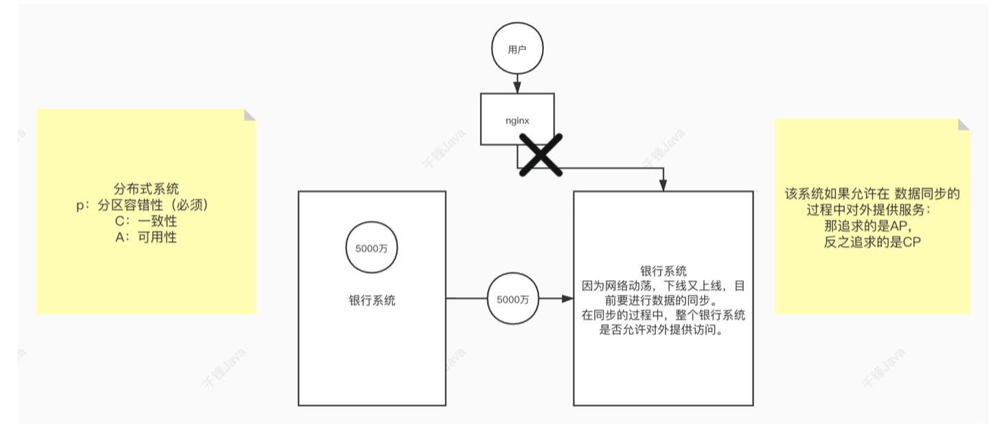

### 3.BASE 理论

eBay 的架构师 Dan Pritchett 源于对⼤规模分布式系统的实践总结，在 ACM 上发表⽂章提出 BASE 理论，BASE 理论是对 CAP 理论的延伸，核⼼思想是即使⽆法做到强⼀致性（Strong Consistency，CAP 的⼀致性就是强⼀致性），但应⽤可以采⽤适合的⽅式达到最终⼀致性 （Eventual Consitency）。

基本可⽤（Basically Available） 基本可⽤是指分布式系统在出现故障的时候，允许损失部分可⽤性，即保证核⼼可⽤。

电商⼤促时，为了应对访问量激增，部分⽤户可能会被引导到降级⻚⾯，服务层也可能只提供降级服务。这就是损失部分可⽤性的体现。

软状态（Soft State） 软状态是指允许系统存在中间状态，⽽该中间状态不会影响系统整体可⽤性。分布式存储中 ⼀般⼀份数据⾄少会有三个副本，允许不同节点间副本同步的延时就是软状态的体现。mysql replication 的异步复制也是⼀种体现。

最终⼀致性（Eventual Consistency） 最终⼀致性是指系统中的所有数据副本经过⼀定时间后，最终能够达到⼀致的状态。弱⼀致 性和强⼀致性相反，最终⼀致性是弱⼀致性的⼀种特殊情况。

### 4.Zookeeper追求的⼀致性

Zookeeper在数据同步时，追求的并不是强⼀致性，⽽是顺序⼀致性（事务id的单调递增）。


------


## ZooKeeper的Shell操作

**ls**

```
作用: 查看某个节点下的子节点
选项: 
    -s 查看具体信息，包括time、version等信息
注意事项: 需要使用绝对路径查看
示例:
    ls /
    ls /zookeeper
    ls -s /zookeeper/config
```


**create**

```
作用: 创建一个节点，可以设置节点的初始内容
选项:
    -e: 设置短暂类型节点
    -s: 设置顺序节点
示例:
	create /test
	create /test2 "content message"
	create -e /test3 "content message"
	create -e -s /test "content message"
```


**get**

```
作用: 获取节点存储的值
选项:
    -s: 同时获取版本描述信息，例如: time、version等
示例:
	get /zookeeper/config
	get -s /zookeeper/config
```


**set**

```
作用: 设置节点存储的值
示例:
	set /test "content message"
```


**delete**

```
作用: 删除节点，只能删除空节点，即没有子节点的节点
示例:
	delete /test
```


**deleteAll**

```
作用: 删除节点，可以递归删除所有的子节点
示例:
	deleteAll /test
```


**addWatch**

```
作用: 监听节点，当这个节点发生变化（内容、创建、删除）会得到通知
示例:
	addWatch /test
```


**removewatches** 

```
作用: 移除对节点的监听
示例:
	removewatches /test
```


**quit**

```
作用: 退出客户端 （服务未关闭）
```

## ZooKeeper的API操作

##### pom依赖

```xml
<dependency>
    <groupId>junit</groupId>
    <artifactId>junit</artifactId>
    <version>4.11</version>
</dependency>
<dependency>
    <groupId>org.apache.zookeeper</groupId>
    <artifactId>zookeeper</artifactId>
    <version>3.6.3</version>
</dependency>
```


##### 初始化ZooKeeper客户端对象

```java
package com.qianfeng.zk;

import org.apache.zookeeper.*;
import org.apache.zookeeper.data.Stat;
import org.junit.Before;
import org.junit.Test;

import java.io.IOException;
import java.util.List;

/**
 * ZooKeeper的API操作
 *
 * @author 千锋大数据教研院-章鱼哥
 * @company 北京千锋互联科技有限公司
 */
public class ZkAPI {
    // Zookeeper客户端对象
    private ZooKeeper zkCli;

    @Before
    public void init() throws IOException, InterruptedException {
        // 连接到ZooKeeper的Server端
        String connectString = "qianfeng01:2181,qianfeng02:2181,qianfeng03:2181";
        // 连接超时时间
        int sessionTimeout = 5000;

        // 初始化一个ZooKeeper客户端实例，需要参数: 服务端、连接超时时间、观察者做回调
        zkCli = new ZooKeeper(connectString, sessionTimeout, new Watcher() {
            @Override
            public void process(WatchedEvent watchedEvent) {
                // 暂不做任何处理
            }
        });
    }
}
```


**注意: 以下的API操作，需要使用到zkCli对象。在上述的初始化部分已经完成了对zkCli对象的初始化。后面的所有操作，只需要将方法粘贴到ZkAPI类中即可。需要导入的包，也在上方的初始化部分导入完成了。**

##### 创建节点（同步）

```java
// ACL权限类型:
//     OPEN_ACL_UNSAFE: 完全开放的ACL，任何连接的客户端都可以操作该节点
//     CREATOR_ALL_ACL: 只有创建者才有ACL权限
//     READ_ACL_UNSAFE: 只能读取ACL
//
// CreateMode:
//     EPHEMERAL: 临时型
//     EPHEMERAL_SEQUENTIAL: 临时顺序型
//     PERSISTENT: 永久型
//     PERSISTENT_SEQUENTIAL: 永久顺序型
//
// 同步创建节点，遇到不正常的情况直接抛出异常。
@Test
public void createNode() throws InterruptedException, KeeperException {
    zkCli.create("/ApiNode1", "ApiContent1".getBytes(), ZooDefs.Ids.OPEN_ACL_UNSAFE, CreateMode.PERSISTENT);
}
```


##### 创建节点（异步）

```java
@Test
public void createNodeAsync() throws InterruptedException {
    zkCli.create("/ApiNode2", "ApiContent2".getBytes(), ZooDefs.Ids.OPEN_ACL_UNSAFE, CreateMode.PERSISTENT, new CreateNodeCallBack(), "");
    // 因为是异步操作，如果不等待一下，操作直接就结束了，来不及等到回调事件的触发
    Thread.sleep(Integer.MAX_VALUE);
}

private static class CreateNodeCallBack implements AsyncCallback.StringCallback {
    /**
     * 异步创建节点回调方法
     * @param i 服务端响应代码: 0 => 成功，-4 => 客户端与服务端连接断开，-110 => 指定节点已存在，-112 => 会话已过期
     * @param s 创建的节点路径
     * @param o 创建节点时传递的ctx
     * @param s1 在ZK上实际创建的节点名（针对顺序节点）
     */
    @Override
    public void processResult(int i, String s, Object o, String s1) {
        System.out.println("i = " + i + ", s = " + s + ", o = " + o + ", s1 = " + s1);
        switch (i) {
            case 0:
                System.out.println("节点创建成功");
                break;
            case -4:
                System.out.println("客户端与服务端连接已断开");
                break;
            case -110:
                System.out.println("指定节点已存在");
                break;
            case -112:
                System.out.println("会话已过期");
                break;
        }
    }
}
```


##### 删除节点（同步）

```java
// 同步删除，遇到无法正常删除的情况，直接异常
@Test
public void deleteNode() throws Exception {
    zkCli.delete("/ApiNode1", -1);
}
```


##### 删除节点（异步）

```java
@Test
public void deleteNodeAsync() throws Exception {
    zkCli.delete("/ApiNode1", -1, new DeleteNodeCallBack(), "");
    Thread.sleep(Integer.MAX_VALUE);
}

/**
 * 删除节点回调
 */
private static class DeleteNodeCallBack implements AsyncCallback.VoidCallback {
    /**
     * 异步删除节点回调方法
     * @param rc 服务端响应代码: 0 => 成功，-4 => 客户端与服务端连接断开，-110 => 指定节点已存在，-112 => 会话已过期
     * @param path 删除的节点路径
     * @param ctx 删除节点时传递的ctx
     */
    @Override
    public void processResult(int rc, String path, Object ctx) {
        System.out.println("删除结果：rc=" + rc + "，path=" + path + "，ctx=" + ctx);
        switch (rc) {
            case 0:
                System.out.println("节点删除成功");
                break;
            case -4:
                System.out.println("客户端与服务端连接已断开");
                break;
            case -112:
                System.out.println("会话已过期");
                break;
            default:
                System.out.println("服务端响应码" + rc + "未知");
                break;
        }
    }
}
```


##### 修改节点内容（同步）

```java
@Test
public void setNode() throws InterruptedException, KeeperException {
    zkCli.setData("/ApiNode1", "hello".getBytes(), -1);
}
```


##### 修改节点内容（异步）

```java
@Test
public void setNodeAsync() throws Exception {
    zkCli.setData("/ApiNode2", "hello".getBytes(), -1, new SetNodeCallBack(), "");
    Thread.sleep(Integer.MAX_VALUE);
}

private static class SetNodeCallBack implements AsyncCallback.StatCallback {
    /**
     * @param rc 服务端响应代码: 0 => 成功，-4 => 客户端与服务端连接断开，-110 => 指定节点已存在，-112 => 会话已过期
     * @param path 修改的节点路径
     * @param ctx  修改节点时传递的ctx
     * @param stat 节点状态，由服务器端响应的新stat替换
     */
    @Override
    public void processResult(int rc, String path, Object ctx, Stat stat) {
        switch (rc) {
            case 0:
                System.out.println("节点数据设置成功");
                break;
            case -4:
                System.out.println("客户端与服务端连接已断开");
                break;
            case -112:
                System.out.println("会话已过期");
                break;
            default:
                System.out.println("服务端响应码" + rc + "未知");
                break;
        }
    }
}
```


##### 获取节点内容（同步）

```java
@Test
public void getNode() throws InterruptedException, KeeperException {
    // 实例化对象，用于记录节点的状态信息
    Stat stat = new Stat();
    // 获取数据
    byte[] data = zkCli.getData("/ApiNode1", true, stat);
    // 打印数据
    System.out.println(new String(data));
    // 打印节点状态信息
    System.out.println(stat);
    System.out.println(stat.getVersion());
    System.out.println(stat.getCtime());
}
```


##### 获取节点内容（异步）

```java
@Test
public void getNodeAsync() throws InterruptedException {
    zkCli.getData("/ApiNode1", true, new GetNodeCallBack(), "");
    Thread.sleep(Integer.MAX_VALUE);
}

private static class GetNodeCallBack implements AsyncCallback.DataCallback {
    /**
     * 获取数据的回调
     * @param rc 服务端响应代码: 0 => 成功，-4 => 客户端与服务端连接断开，-110 => 指定节点已存在，-112 => 会话已过期
     * @param path 获取数据的节点路径
     * @param ctx 获取数据时传递的ctx
     * @param data 获取到的节点数据
     * @param stat 获取到的节点状态
     */
    @Override
    public void processResult(int rc, String path, Object ctx, byte[] data, Stat stat) {
        switch (rc) {
            case 0:
                System.out.println("节点数据获取成功: " + new String(data));
                break;
            case -4:
                System.out.println("客户端与服务端连接已断开");
                break;
            case -112:
                System.out.println("会话已过期");
                break;
            default:
                System.out.println("服务端响应码" + rc + "未知");
                break;
        }
    }
}
```


##### 获取所有子节点（同步）

```java
@Test
public void getChildren() throws InterruptedException, KeeperException {
    List<String> children = zkCli.getChildren("/", true);
    System.out.println(children);
}
```


##### 获取所有子节点（异步）

```java
@Test
public void getChildrenAsync() throws InterruptedException {
    zkCli.getChildren("/", true, new GetChildrenCallBack(), "");
    Thread.sleep(Integer.MAX_VALUE);
}

private static class GetChildrenCallBack implements AsyncCallback.ChildrenCallback {

    /**
     * 获取到所有的子节点的回调
     * @param rc 服务端响应代码: 0 => 成功，-4 => 客户端与服务端连接断开，-110 => 指定节点已存在，-112 => 会话已过期
     * @param path 获取子节点的节点路径
     * @param ctx 调用方法传递的ctx
     * @param children 所有的子节点
     */
    @Override
    public void processResult(int rc, String path, Object ctx, List<String> children) {
        switch (rc) {
            case 0:
                System.out.println("子节点获取成功: " + children);
                break;
            case -4:
                System.out.println("客户端与服务端连接已断开");
                break;
            case -112:
                System.out.println("会话已过期");
                break;
            default:
                System.out.println("服务端响应码" + rc + "未知");
                break;
        }
    }
}
```


