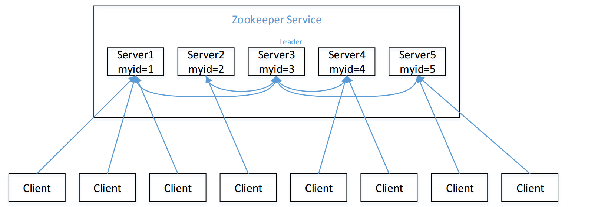
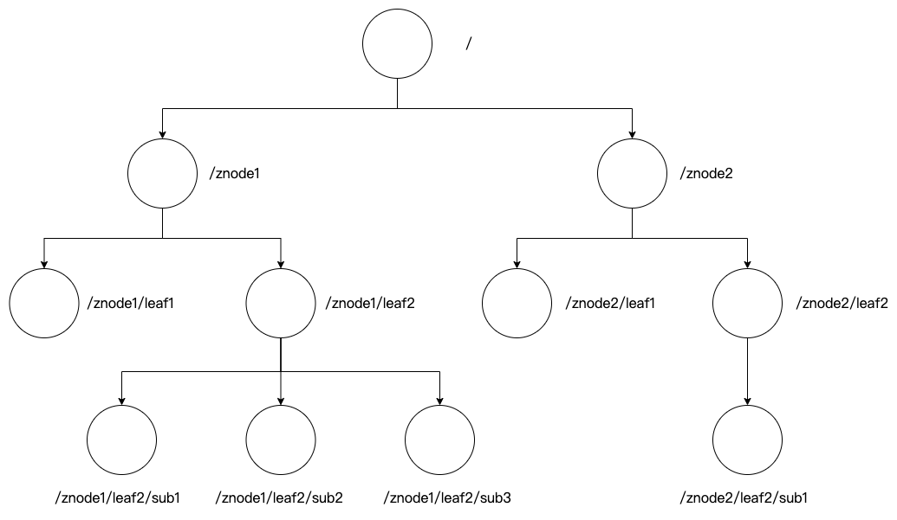

## Zookeeper简介

Zookeeper是一个分布式协调服务的开源框架，它是由Google的Chubby开源实现。Zookeeper主要用来解决分布式集群中应用系统的一致性问题，例如如何避免同时操作同一数据造成脏读的问题等。

Zookeeper 本质上是一个分布式的小文件存储系统。 提供基于类似于文件系统的目录树方式的数据存储，并且可以对树中的节点进行有效管理。从而用来维护和监控你存储的数据的状态变化。通过监控这些数据状态的变化，从而可以达到基于数据的集群管理。 诸如：统一命名服务、分布式配置管理、分布式消息队列、分布式锁、分布式协调等功能。

## Zookeeper的特性

Zookeeper具有全局数据一致性、可靠性、顺序性、原子性以及实时性，可以说Zookeeper的其他特性都是为满足Zookeeper全局数据一致性这一特性。具体介绍如下：

**1．全局数据一致**

每个服务器都保存一份相同的数据副本，客户端无论连接到集群的任意节点上，看到的目录树都是一致的（也就是数据都是一致的），这也是Zookeeper最重要的特征。

**2．可靠性**

如果消息（对目录结构的增删改查）被其中一台服务器接收，那么将被所有的服务器接收。节点更新以后，在下次更新之前，它的数据不会发生变更；

**3．顺序性**

Zookeeper顺序性主要分为全局有序和偏序两种，其中全局有序是指如果在一台服务器上消息A在消息B前发布，则在所有服务器上消息A都将在消息B前被发布；偏序是指如果一个消息B在消息A后被同一个发送者发布，A必将排在B前面。无论全局有序还是偏序，其目的都是为了保证Zookeeper全局数据一致。

**4．数据更新原子性**

一次数据更新要么成功（半数以上节点成功），要么失败，不存在中间状态。

**5．实时性**

Zookeeper保证客户端将在一个时间间隔范围内获得服务器的更新信息，或者服务器失效的信息。

## Zookeeper集群架构

Zookeeper对外提供一个类似于文件系统的层次化的数据存储服务，为了保证整个Zookeeper集群的容错性和高性能，每一个Zookeeper集群都是由多台服务器节点（Server）组成，这些节点通过复制保证各个服务器节点之间的数据一致。只要当这些服务器节点过半数节点可用，那么整个Zookeeper集群就可用。

Zookeeper集群是一个主从集群，它一般是由一个**Leader（领导者）**和多个**Follower（跟随者）**组成。此外，针对访问量比较大的Zookeeper集群，还可新增**Observer（观察者）**。

**1．Leader**

它是Zookeeper集群工作的核心，也是事务性请求（写操作）的唯一调度和处理者，它保证集群事务处理的顺序性，同时负责进行投票的发起和决议，以及更新系统状态。

**2．Follower**

它负责处理客户端的非事务（读操作）请求，如果接收到客户端发来的事务性请求，则会转发给Leader，让Leader进行处理，同时还负责在Leader选举过程中参与投票。

**3．Observer**

它负责观察Zookeeper集群的最新状态的变化，并且将这些状态进行同步。对于非事务性请求可以进行独立处理；对于事务性请求，则会转发给Leader服务器进行处理。它不会参与任何形式的投票，只提供非事务性的服务，通常用于在不影响集群事务处理能力的前提下，提升集群的非事务处理能力（提高集群读的能力，也降低了集群选主的复杂程度）。

## Zookeeper的数据模型

### 存储结构

Zookeeper中数据存储的结构和标准文件系统非常类似，拥有一个层次的命名空间，也是使用斜杠（/）进行分割，两者都是采用树形层次结构。不同的是，标准文件系统是由文件夹和文件来组成的树，Zookeeper是由节点组成的树，树中的每个节点被称为—Znode。znode既可以作为保存数据的容器(如同文件),也可以作为保存其他znode的容器(如同目录)。

- Zookeeper被设计用来实现协调服务，这类服务通常使用小数据文件，而不是用于大容量数据存储，因此一个znode能存储的数据被限制在1MB以内，
- 每个znode都可以通过其路径唯一标识。

Zookeeper数据模型中的每个Znode都是由三部分组成，分别是stat（状态信息，描述该Znode的版本，权限信息等组成）、data（与该Znode关联的数据）、children（该Znode下的子节点）。

### Znode的类型

Znode有两种类型，分别是临时节点和永久节点。

**临时节点**，该生命周期依赖于创建它们的会话，一旦会话结束，临时节点将会被自动删除，当然也可以手动删除。虽然每个临时的Znode都会绑定到一个客户端，但它们对所有的客户端还是可见的。另外，需要注意的是临时节点不允许拥有子节点。

**永久节点**，该生命周期不依赖于会话，并且只有在客户端显示执行删除操作的时候，它们才能被删除。

由于Znode的序列化特性，在创建节点时，用户可以请求在该Znode的路径结尾添加一个不断增加的序列号，序列号对于此节点的父节点来说是唯一的，这样便会记录每个子节点创建的先后顺序。它的格式为“%010d”（10位数字，没有数值的数位用0补充，例如“0000000001”）。当计数值大于232-1时，计数器将会溢出。

这样便会存在四种类型的目录节点，分别对应如下：

- PERSISTENT：永久节点
- EPHEMERAL：临时节点
- PERSISTENT_SEQUENTIAL：序列化永久节点
- EPHEMERAL_SEQUENTIAL：序列化临时节点

### Znode的属性

Zookeeper节点属性

| **属性名称**   | **属性描述**                                                 |
| -------------- | ------------------------------------------------------------ |
| czxid          | 节点被创建的Zxid值                                           |
| ctime          | 节点被创建的时间                                             |
| mzxid          | 节点最后一次的修改的Zxid值                                   |
| mtime          | 节点最后一次的修改时间                                       |
| pZxid          | 与该节点的子节点最后一次修改的Zxid值                         |
| cversion       | 子节点被修改的版本号                                         |
| dataVersion    | 数据版本号                                                   |
| aclVersion     | ACL版本号                                                    |
| ephemeralOwner | 如果此节点为临时节点，那么该值代表这个节点拥有者的会话ID；否则值为0 |
| dataLength     | 节点数据域长度                                               |
| numChildren    | 节点拥有的子节点个数                                         |

对于Zookeeper来说，Znode状态改变的每一个操作都将使节点接收到唯一的zxid（Zookeeper Transaction ID）格式的时间戳，并且这个时间戳是全局有序的，通常被称为事物ID，通过zxid，可以确定更新操作的先后顺序