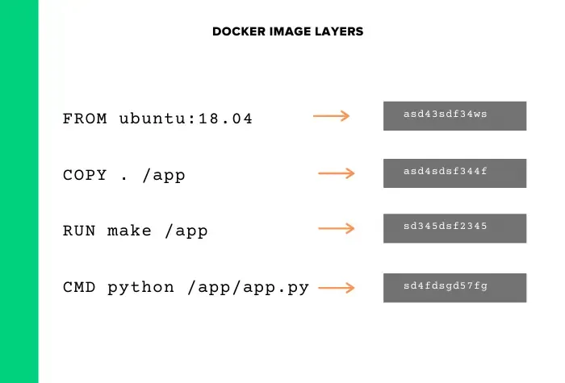

# docker

## 什么是 Linux 容器 (LXC)？

在深入了解底层容器概念之前，我们需要了解两个关键的 Linux 概念：

1. **用户空间（user space）：**运行用户程序（应用程序、进程）所需的所有代码被称为用户空间。当启动程序操作时，例如创建一个文件，用户空间中的进程会向内核空间发出系统调用。
2. **内核空间（kernel space）：**这里有着与系统硬件、存储等交互的内核代码，是操作系统的核心。


### 容器是一个进程

当我们启动一个应用程序，比如说 Nginx Web 服务器，这个时候实际上是在启动一个进程。而进程本身是一个具有有限隔离的自包含指令。

那么如果我们仅使用进程运行和操作所需的文件与配置来隔离进程，又会怎样呢？

而这正是容器的工作原理。

容器基本上是一个具有足够隔离用户空间组件的进程，因此它给人一种独立操作系统的感觉。


每个容器都有其独立的用户空间，我们可以在单个主机上运行多个容器。这是否意味着容器拥有整个操作系统？

当然不是。**与拥有自己内核的虚拟机不同，容器只包含与特定发行版相关的所需文件，并使用共享主机内核。**

有意思的是，我们可以在共享相同内核空间的单个主机上运行基于不同 Linux 发行版的容器。例如，我们可以在 Ubuntu 服务器上运行 RHEL、CentOS、基于 SUSE 的容器。这是可行的，因为对于所有 Linux 发行版，只有用户空间不同，内核空间相同。

### Linux 容器的基本概念

Linux 有两个重要的内核功能，分别是**命名空间（namespaces）**和**控制组（control groups）**。在主机中，容器与容器之间的隔离正是由这两个内核功能实现的。

**命名空间（namespaces）**

创建容器就是创建一个隔离良好的环境来运行服务（进程）。为了达到这种级别的隔离，容器应该要有自己的文件系统、IP 地址、挂载点、进程 ID 等，这就需要使用 Linux 命名空间来实现这一点。

命名空间为容器设置了边界，让容器拥有了自己的挂载点、用户、IP 地址、以及进程管理等。

Linux 中的重要的命名空间有：

- **pid namespace：**负责隔离进程（PID：Process ID）。
- **net 命名空间：**负责管理网络接口（NET：网络）。
- **ipc 命名空间：**负责管理对 IPC 资源的访问（IPC：进程间通信）。
- **mnt 命名空间：**负责管理文件系统挂载点（MNT：Mount）。
- **uts 命名空间：**隔离内核和版本标识符。（UTS：Unix 分时系统）。
- **usr 命名空间：**隔离用户 ID。简单来说，它隔离了主机和容器之间的用户 ID。
- **Cgroup 命名空间：**将控制组信息与容器进程隔离。

使用这些命名空间，容器可以拥有自己的网络接口、IP 地址等。每个容器都拥有自己的命名空间，并且在该命名空间内运行的进程在其他命名空间中没有任何权限。

此外，我们还可以使用该 lsns 命令列出 Linux 机器中的命名空间。

**Linux 控制组**

当我们启动服务时，我们不会自己指定划分任何内存或者 CPU 限制，而是让内核来为服务划分优先级和分配资源。

但是，我们可以使用 Linux 的内核功能控制组 CGroups，为我们自己的服务设置明确的 CPU 和内存限制。但它不是一种很直接的方法，我们还需要进行一些额外的配置和调整。

由于我们可以在主机内运行多个容器，因此应该有一种机制来限制资源的使用、设备的访问等。而这里正是控制组的用武之地。

Linux 控制组管理着容器使用的资源，我们可以限制容器的 CPU、内存、网络和 IO 资源。

那么如果我们不限制容器的 CPU 和内存资源又会怎样呢？

如果不限制，单个容器可能最终会占用所有的主机资源，无资源可用就会导致其他容器的崩溃。

像 Docker 这样的工具抽象出了所有复杂的后端配置，从而让我们只需要简单地设定参数，就可以指定这些资源限制。

## 什么是 Docker

Docker 是一个流行的用 Go 语言开发的开源项目，由 Dotcloud 公司开发。

Docker 基本上就是一个容器引擎，它使用 Linux 内核功能（如命名空间和控制组）在操作系统之上创建容器。

这就意味着，Docker 可以十分轻易地完成我们在 LXC 部分中所学到的所有有关容器的概念和功能 。只需执行一些 Docker 命令，我们就可以启动和运行一个容器。

在这里我们可能会产生一些困惑， Docker 与 Linux 容器 (LXC) 又有什么不同呢？毕竟两者的概念和实现看起来是那么的相似。

Docker 最初是构建在 Linux 容器 (LXC) 之上的，但后来 Docker 用自己的容器运行时 libcontainer（现在是runc 的一部分）替换了 LXC。

此外，除了作为一种容器技术之外，Docker 还具有定义明确的包装器组件，这使打包应用程序变得十分容易。要知道，在 Docker 出现之前，运行容器并不是一件容易的事。所有的这一切意味着，Docker 通过将所有应用程序系统的需求打包到容器中，完成了将应用程序与基础设施分离的所有工作。

例如，如果有一个 Java jar 文件，我们可以在任何安装了 java 的服务器上运行它。同样的，一旦使用 Docker 将容器与所需的应用程序打包在一起，我们就可以在任何其他安装了 Docker 的主机上运行它。

## Docker 的核心架构

当 Docker 最初推出时，它具有单体架构，现在它分为以下三个不同的组成部分。

- Docker 引擎 (dockerd)
- docker-containerd (containerd)
- docker-runc (runc)


**Docker 引擎**

Docker daemon (dockerd) 作为 dockerd systemd 服务持续运行，它负责构建 docker 镜像。

dockerd 调用 docker-containerd 接口，来管理图像和运行容器。

**docker-containerd (containerd)**

containerd 是另一个系统 daemon 程序服务，它负责下载 docker 镜像并将它们作为容器运行。containerd 通过公开 API 来接收来自 dockerd 服务的指令。

**docker-runc**

runc 是容器运行时，负责创建容器所需的命名空间和 cgroup，然后在这些命名空间内运行容器命令。runc 运行时是按照 OCI 规范实现的。

## docker的CS架构

实际上docker使用了常见的CS架构，也就是client-server模式，docker client负责处理用户输入的各种命令，比如docker build、docker run，真正工作的其实是server，也就是docker demon，值得注意的是，docker client和docker demon可以运行在同一台机器上。


| 组件         | 描述                                                         |
| ------------ | ------------------------------------------------------------ |
| Client       | 提供用户跟Docker交互的入口，可以通过client跟docker发送各种API |
| docker damon | 用于监听并处理docker client发送的api请求并且管理docker镜像(images), 容器(container)以及文件结构。同时也用于跟其它docker daemon进行交互 |
| Registry     | docker存储镜像的仓库。Docker Hub是一个公共仓库，类似与maven的中心仓库，默认情况下docker会从该公共仓库获取镜像。当然docker也可以像maven一样有自己的私有registry |
| image        | 和container都是docker的对象。 docker image主要定义docker容器执行指令的模板。可以把docker image比作是java的类，docker container比作的java的对象，docker的镜像通常都是在另一个image基础上构建的 |
| container    | 和image都是docker的对象，container是docker镜像的运行实例，用户可以通过docker api对docker容器进行start/stop/create/move/delete等等操作 |


Docker 有一个用于构建镜像的概念—— **Dockerfile** 。Dockerfile 基本上就是一个文本文件，每一行包含一个命令（指令）。


Docker 镜像是用分层的方式来组织的。Dockerfile 上的每条指令都会在镜像中添加一个图层。镜像最顶层的可写层是容器。

每个镜像都是从一个基础镜像创建起的。

镜像的顶层是可写的，并由正在运行的容器使用。图像中的其他层是只读的。




## docker的工作流程：

**1，docker build**

当我们写完dockerfile交给docker“编译”时使用这个命令，那么client在接收到请求后转发给docker daemon，接着docker daemon根据dockerfile创建出“可执行程序”image。

**2，docker run**

有了“可执行程序”image后就可以运行程序了，接下来使用命令docker run，docker daemon接收到该命令后找到具体的image，然后加载到内存开始执行，image执行起来就是所谓的container。

**3，docker pull**

docker registry 可以用来存放各种image，公共的可以供任何人下载image的仓库就是docker Hub。那么该怎么从Docker Hub中下载image呢，就是这里的docker pull命令了。

因此，这个命令的实现也很简单，那就是用户通过docker client发送命令，docker daemon接收到命令后向docker registry发送image下载请求，下载后存放在本地，这样我们就可以使用image了。


## 与虚拟机对比


## 实例：制作自己的 Docker 容器

下面我以 [koa-demos](https://www.ruanyifeng.com/blog/2017/08/koa.html) 项目为例，介绍怎么写 Dockerfile 文件，实现让用户在 Docker 容器里面运行 Koa 框架。

作为准备工作，请先[下载源码](https://github.com/ruanyf/koa-demos/archive/master.zip)。

> ```bash
> $ git clone https://github.com/ruanyf/koa-demos.git
> $ cd koa-demos
> ```

### 10.1 编写 Dockerfile 文件

首先，在项目的根目录下，新建一个文本文件`.dockerignore`，写入下面的[内容](https://github.com/ruanyf/koa-demos/blob/master/.dockerignore)。

> ```bash
> .git
> node_modules
> npm-debug.log
> ```

上面代码表示，这三个路径要排除，不要打包进入 image 文件。如果你没有路径要排除，这个文件可以不新建。

然后，在项目的根目录下，新建一个文本文件 Dockerfile，写入下面的[内容](https://github.com/ruanyf/koa-demos/blob/master/Dockerfile)。

> ```bash
> FROM node:8.4
> COPY . /app
> WORKDIR /app
> RUN npm install --registry=https://registry.npm.taobao.org
> EXPOSE 3000
> ```

上面代码一共五行，含义如下。

> - `FROM node:8.4`：该 image 文件继承官方的 node image，冒号表示标签，这里标签是`8.4`，即8.4版本的 node。
> - `COPY . /app`：将当前目录下的所有文件（除了`.dockerignore`排除的路径），都拷贝进入 image 文件的`/app`目录。
> - `WORKDIR /app`：指定接下来的工作路径为`/app`。
> - `RUN npm install`：在`/app`目录下，运行`npm install`命令安装依赖。注意，安装后所有的依赖，都将打包进入 image 文件。
> - `EXPOSE 3000`：将容器 3000 端口暴露出来， 允许外部连接这个端口。

### 10.2 创建 image 文件

有了 Dockerfile 文件以后，就可以使用`docker image build`命令创建 image 文件了。

> ```bash
> $ docker image build -t koa-demo .
> # 或者
> $ docker image build -t koa-demo:0.0.1 .
> ```

上面代码中，`-t`参数用来指定 image 文件的名字，后面还可以用冒号指定标签。如果不指定，默认的标签就是`latest`。最后的那个点表示 Dockerfile 文件所在的路径，上例是当前路径，所以是一个点。

如果运行成功，就可以看到新生成的 image 文件`koa-demo`了。

> ```bash
> $ docker image ls
> ```

### 10.3 生成容器

`docker container run`命令会从 image 文件生成容器。

> ```bash
> $ docker container run -p 8000:3000 -it koa-demo /bin/bash
> # 或者
> $ docker container run -p 8000:3000 -it koa-demo:0.0.1 /bin/bash
> ```

上面命令的各个参数含义如下：

> - `-p`参数：容器的 3000 端口映射到本机的 8000 端口。
> - `-it`参数：容器的 Shell 映射到当前的 Shell，然后你在本机窗口输入的命令，就会传入容器。
> - `koa-demo:0.0.1`：image 文件的名字（如果有标签，还需要提供标签，默认是 latest 标签）。
> - `/bin/bash`：容器启动以后，内部第一个执行的命令。这里是启动 Bash，保证用户可以使用 Shell。

如果一切正常，运行上面的命令以后，就会返回一个命令行提示符。

> ```bash
> root@66d80f4aaf1e:/app#
> ```

这表示你已经在容器里面了，返回的提示符就是容器内部的 Shell 提示符。执行下面的命令。

> ```bash
> root@66d80f4aaf1e:/app# node demos/01.js
> ```

这时，Koa 框架已经运行起来了。打开本机的浏览器，访问 http://127.0.0.1:8000，网页显示"Not Found"，这是因为这个 [demo](https://github.com/ruanyf/koa-demos/blob/master/demos/01.js) 没有写路由。

这个例子中，Node 进程运行在 Docker 容器的虚拟环境里面，进程接触到的文件系统和网络接口都是虚拟的，与本机的文件系统和网络接口是隔离的，因此需要定义容器与物理机的端口映射（map）。

现在，在容器的命令行，按下 Ctrl + c 停止 Node 进程，然后按下 Ctrl + d （或者输入 exit）退出容器。此外，也可以用`docker container kill`终止容器运行。

> ```bash
> # 在本机的另一个终端窗口，查出容器的 ID
> $ docker container ls
> 
> # 停止指定的容器运行
> $ docker container kill [containerID]
> ```

容器停止运行之后，并不会消失，用下面的命令删除容器文件。

> ```bash
> # 查出容器的 ID
> $ docker container ls --all
> 
> # 删除指定的容器文件
> $ docker container rm [containerID]
> ```

也可以使用`docker container run`命令的`--rm`参数，在容器终止运行后自动删除容器文件。

> ```bash
> $ docker container run --rm -p 8000:3000 -it koa-demo /bin/bash
> ```

### 10.4 CMD 命令

上一节的例子里面，容器启动以后，需要手动输入命令`node demos/01.js`。我们可以把这个命令写在 Dockerfile 里面，这样容器启动以后，这个命令就已经执行了，不用再手动输入了。

> ```bash
> FROM node:8.4
> COPY . /app
> WORKDIR /app
> RUN npm install --registry=https://registry.npm.taobao.org
> EXPOSE 3000
> CMD node demos/01.js
> ```

上面的 Dockerfile 里面，多了最后一行`CMD node demos/01.js`，它表示容器启动后自动执行`node demos/01.js`。

你可能会问，`RUN`命令与`CMD`命令的区别在哪里？简单说，`RUN`命令在 image 文件的构建阶段执行，执行结果都会打包进入 image 文件；`CMD`命令则是在容器启动后执行。另外，一个 Dockerfile 可以包含多个`RUN`命令，但是只能有一个`CMD`命令。

注意，指定了`CMD`命令以后，`docker container run`命令就不能附加命令了（比如前面的`/bin/bash`），否则它会覆盖`CMD`命令。现在，启动容器可以使用下面的命令。

> ```bash
> $ docker container run --rm -p 8000:3000 -it koa-demo:0.0.1
> ```

### 10.5 发布 image 文件

容器运行成功后，就确认了 image 文件的有效性。这时，我们就可以考虑把 image 文件分享到网上，让其他人使用。

首先，去 [hub.docker.com](https://hub.docker.com/) 或 [cloud.docker.com](https://cloud.docker.com/) 注册一个账户。然后，用下面的命令登录。

> ```bash
> $ docker login
> ```

接着，为本地的 image 标注用户名和版本。

> ```bash
> $ docker image tag [imageName] [username]/[repository]:[tag]
> # 实例
> $ docker image tag koa-demos:0.0.1 ruanyf/koa-demos:0.0.1
> ```

也可以不标注用户名，重新构建一下 image 文件。

> ```bash
> $ docker image build -t [username]/[repository]:[tag] .
> ```

最后，发布 image 文件。

> ```bash
> $ docker image push [username]/[repository]:[tag]
> ```

发布成功以后，登录 hub.docker.com，就可以看到已经发布的 image 文件。


## 常用命令

``` shell
$ docker image build -t [imagename] [path] #-t参数用来指定 image 文件的名字，后面还可以用冒号指定标签。如果不指定，默认的标签就是latest。最后的那个点表示 Dockerfile 文件所在的路径，上例是当前路径，所以是一个点。

$ docker image ls #查看image 文件

$ docker container run [imagename]

# 列出本机正在运行的容器
$ docker container ls

# 列出本机所有容器，包括终止运行的容器
$ docker container ls --all

#删除容器文件
$ docker container rm [containerID]

# 停止指定的容器运行
$ docker container kill [containerID]

#用来启动已经生成、已经停止运行的容器文件。
$ docker container start [containerID]

#相当于向容器里面的主进程发出 SIGTERM 信号，然后过一段时间再发出 SIGKILL 信号。应用程序收到 SIGTERM 信号以后，可以自行进行收尾清理工作，但也可以不理会这个信号。如果收到 SIGKILL 信号，就会强行立即终止，那些正在进行中的操作会全部丢失。
$ docker container stop [containerID]

$ docker container logs [containerID]

$ docker image pull [imagename]
```

